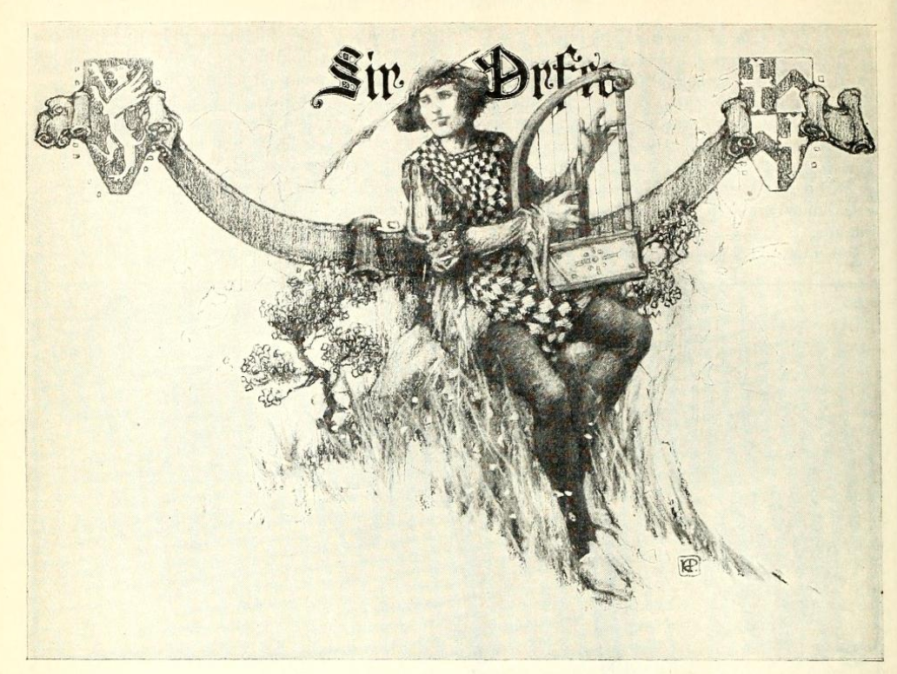
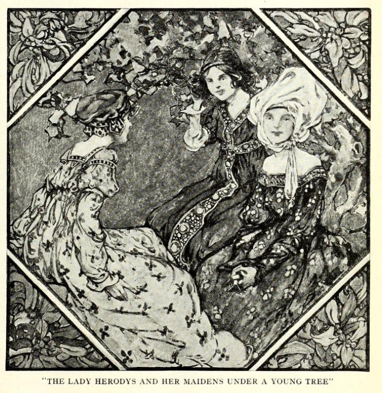
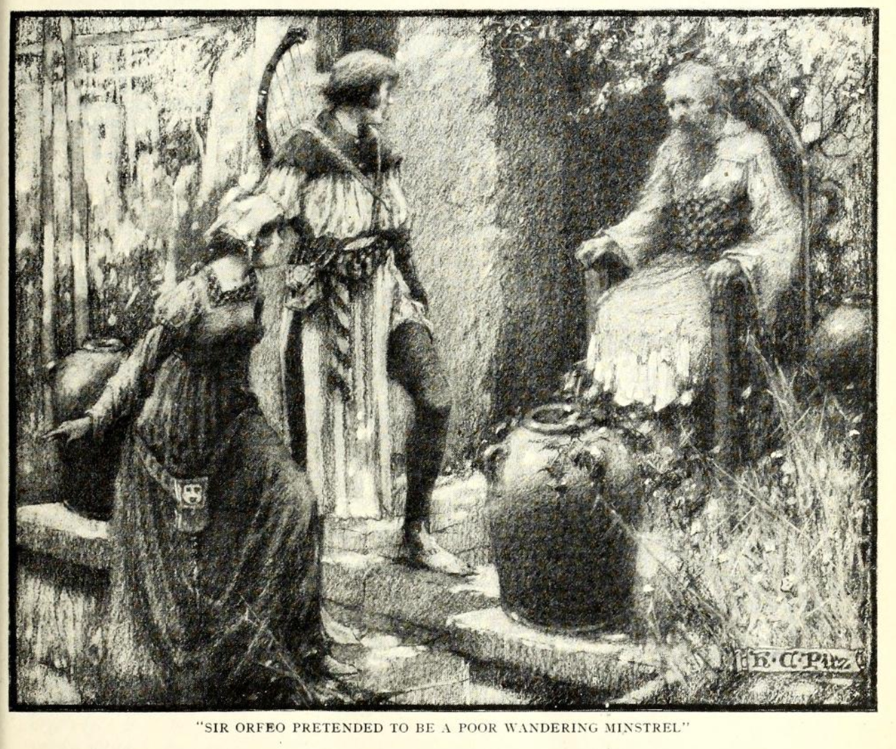

# Sir Orfeo

A mediaeval retelling of the myth of *Orpheus and Eurydice*, which I've used previously  to frame the sinking of HMS Eurydice (see [*On the Loss of the Eurydice*](https://psychemedia.github.io/eurydice-resources/_preface.html)), recast as a tale of a proud (and not in a good way!) knight who is beset by misfortune and who sets out to recover his wife who is kidnapped into the land of Faerie.

I first came across this in the back of the paperback version of *Sir Gawain and the Green Knight, with Pearl and Sir Orfeo*, Harper Collins, 2021, translated by J.R.R. Tolkien, ed. C. Tolkien, and have since told it as part of a *Stories'n'Harp* set, accompanied by harpist Theresa Ellis.

````{admonition} Example telling
:class: dropdown seealso
An example telling, with a harp, by someone not me, and a harpist not Theresa...

```{youtube} A2LpzXKG_hk
```
````

To get a flavour of the tale, Krapp provides the following narrative version, published in 1921:

```{admonition} In Krapp, *Tales of true knights*, 1921
:class: dropdown
George Philip Krapp, [*Tales of true knights*](https://archive.org/details/TalesOfTrueKnightsKrapp/page/n195/mode/2up), 1921, pp165-184.

SIR ORFEO

SIR ORFEO was a brave knight and a true, and he dwelt in the land of the Grecians. Of high kin he was, for his father came of the stock of King Pluto, who ruled over the nether world, and his mother was of the race of Juno, the queen of the heavens. Wisely and well Sir Orfeo governed his people, sparing neither pains nor trouble to make them happy. One thing in this world, however, Sir Orfeo was more zealous in than in caring for the welfare of his people, and this one thing was the music the gleemen made in their harping. A welcome was ready for every good harper who found his way to Sir Orfeo's castle, and there you were always sure of meeting with the best of them. Sir Orfeo himself took great joy in harping, and so earnestly did he busy himself in that art that no one of the great throng of minstrels who came to his castle could boast himself a better harper than its master.

A fair lady named Herodys was the wife of Sir Orfeo, and among all the Grecians none was praised more highly for her gentleness and beauty. Now, it happened once upon a sunny morning in May that the Lady Herodys called her two maidens and went forth in the freshness of the day to walk in her garden. The bitter storms of winter were now past, and everywhere the flowers were springing in the green grass, and every spray and bough of the bushes was covered with bright blossoms. The sun made the air so soft and pleasant, the birds sang so gaily, and the flowers spread abroad such sweetness, that the Lady Herodys and her two maidens sat them down under a young tree to take their joy in the mild season. For a while they praised the beauties of this spring morning, and then talked of this and that, until a heaviness weighed down the eyelids of the Lady Herodys and she leaned on her elbow on the soft grass and fell into a deep slumber.

Silently the two maidens stole away to another part of the garden, and there they amused themselves for some time in merry talk and laughter. When they thought their lady must have roused from her slumber, they came back to the young tree, but were surprised to find her lying there and still soundly sleeping. They knew not what to do, for they could not be so bold as to wake their mistress, yet they thought it strange her sleep should be so lasting. Quietly they sat them down beside their lady and patiently waited for her eyes to open. But the sun mounted higher and higher, and passed over their heads at the noontide, and already was sinking to the western sky in the dusk of the evening, before the Lady Herodys stirred and gave signs of return to the land of the living. Suddenly her eyes flew open, and she started up in fear and trembling. She wrung her hands in grief, and cried aloud in pain and sorrow. More like one who had lost her reason she bore herself than like the gentle Herodys. Hastening to her side, the two maidens sought to comfort their lady, but Herodys paid no heed to them and seemed not to hear the words they spake to her. In terror and dismay at what had happened, the two maidens ran quickly to the castle for help, and soon they came back with a throng of anxious knights and ladies. Tenderly they bore the weeping Herodys back to the castle and placed her on her couch, where she lay like one who has been dazed by some great sorrow.

When word of all this was carried to Sir Orfeo, he hastened with all speed to his lady's bower, and great was his wonder and grief to see the sad change in her.

"Alas!" he said, "what hath gone amiss? Look up, dear wife, and tell me what this may mean. Art thou my gentle Herodys, and now dost lie so cold and still? Are these thine eyes that look upon me as though I were a stranger and thy foe? Take heart, dear wife, and tell me now the cause of all thy grief."

At these and other kind words of Sir Orfeo, the Lady Herodys at length took courage, and soon she began to speak.

"Sorrow has come upon us, Sir Orfeo," said she. "This many a day hast thou cherished me, and as truly have I loved thee. But now no more may we think of that, for soon must we part in twain. This day the call has come to me."

"What words are these! " exclaimed Sir Orfeo; "and why speakest thou so strangely? If thou must away from me, whither wilt thou go and to whom? But I know thou canst not mean it so, for wherever thou goest, far or near, there truly shall I go with thee."

"Nay," answered Herodys, "that is even the heaviest of my sorrow, that now thou canst not go with me. Listen, and I will tell thee all how the summons has come to me. Even this day I have been called, and to-morrow in the morning I must away. For thus it was that this day as I lay and slept on the fresh green grass beneath one of my garden trees, behold two fair knights suddenly appeared to me. Well arrayed they were in all good knightly gear, and courteous were their words when they spake to me and bade me come without delay to speak with their master the king. Then I answered these two knights boldly enough, and said that I neither could nor would come to speak with their stranger king. They paused not, but away they sped when I had thus spoken. Quickly they were back, and with them rode a band wonderful to see. Well-nigh a thousand of the fairest knights and ladies came trooping over the garden lawns, and among them came riding their king. On snow-white steeds all this band were seated, and white as the lily-flower were the shining garments that each one wore. A bright crown, gleamed on the head of the king, not made of silver or of gold, but all of precious stones that shone like the sun in the heavens when the sky is most clear.

"Light as thistle-down in the wind they rode, and when all this band of white-robed knights and ladies had reached the place where I lay beneath my garden tree, the king placed me beside him on his own milk-white steed. In the flashing of an eye we were off, the whole bright troop together. The silver bells jingled in the wind and away we sped through forest and field, past river and brook, past mountain and mead, until at last we came to a strange land the like of which mortal eye hath never seen. In the center of the land there rose the wondrous palace of this king. With pinnacles and towers it shone, all built of the white marble stone, and about it spread green meadows and fields and fair gardens as far as eye could see. The flowers were springing and the birds were singing, and here, if anywhere, the days seemed happy and free.

"Then this king showed me everything, his halls all spangled with crystal gems like the stars that shine in the night, and all his sweet meadows and gardens and fields, where countless number of his folk led their lives in pleasure and peace. Suddenly he placed me again on his milk-white steed, and back from this land we sped, past village and town, past river and mountain, until he had brought me to my own garden here, and placed me again beneath my tree. 'To-morrow I shall come for thee,' were his last words to me, 'and see that I find thee beneath thy tree. To the other-world thou must wend, and dwell forever in my land.' With these words this king disappeared, and all the white steeds and all the fair folk in their glistening garments who had ridden thither with him. Then I awoke, and grief was at my heart, for at last the call had come to me. To-morrow I must leave thee, and whither I go, thou canst not come."

When Sir Orfeo had heard all this strange story, he saw well that he had need of wise counsel.

"Rather it had been my life," said he, sorrowfully, "than that the Lady Herodys should be borne away from me. Yet truly that shall not be done, if the might of my hand can aught avail."

Since he had not the wisdom of the other-world, Sir Orfeo was resolute to use all he had of this, and when the morrow was come, and the hour which the king had set for his tryst, then he took all his companions in arms—a hundred or more they were—and with swords in their hands and armor on their backs, they surrounded the Lady Herodys beneath her garden tree. Sadly the lady smiled, for well she knew that this was all in vain, and that by no such arts could the other-world king be prevented of his will. And then, while the knights stood waiting with swords in their hands for their enemy to appear, suddenly before their eyes, they knew not how, the lady was twitched away from them and was no more to be seen. The swords clashed on one another, or struck emptily at the thin air, but no foe was there for mortal hands to harm. Silently and wonderingly the knights gazed at each other. But the Lady Herodys was gone, and naught was there to do but lead the hapless Sir Orfeo back to his castle halls, all desolate and empty now.

From this very hour when the Lady Herodys was borne away, a great change came over Sir Orfeo. All his days were now spent in revery and solitude. More and more he put his subjects and his lands and his cattle into the care of his faithful steward, and he himself withdrew apart from all men to the quiet rooms of his castle. All the cares and pastimes which of old had made his days so bright and stirring were now forgotten except one, and this one was the playing of the harp. To his harp alone Sir Orfeo told all the grief of his heart, and it was in his harp that he found his only relief from pain and sorrow.

It happened at length that Sir Orfeo broke his silence, and calling all his people together, he told them what he was now minded to do.

"Friends and companions," said he to them, "I now appoint my steward here to rule in my stead. Obey him and serve him, if ye will show your love to me. And when, as time goes by, ye shall learn that Sir Orfeo no longer lives and moves upon this earth, then call ye a meeting of all my folk and choose from among yourselves one to be your ruler and prince. Now I must away. No longer shall I look upon the faces of my friends, but deep in the forest and far from the haunts of men I shall take up my dwelling-place. I have lost that which all this world cannot restore, and from this day I renounce all that this world has yet to give."

With sorrow the people heard these words of their good prince, and all besought him to take comfort for his loss, and not to leave them for the hard and desolate life of the pathless forest. But Sir Orfeo was not to be turned from his will. He bade them all farewell, and with nothing but his harp in his hands and his cloak upon his shoulders, he set forth on his solitary way.

A strange life was this that Sir Orfeo now led. He who had once been lord of a hundred knights, now wandered forth alone, as poor as the poorest hermit in the land. When the night came, he had naught to shelter him but the leaves and boughs of the forest. The rain and the sun of the heavens were free to beat upon him, and no shelter he knew from the winds, however boisterous and blustering. No eager servers now set rich food before him in bright silver dishes, as in the old days in his castle, but with the labor of his hands he must search for roots and herbs and such other hard fare as the forest yields to answer the needs of the body.

But all was not hardship for Sir Orfeo in the life of the forest. Now again his heart was quiet, and in the still afternoons, or when the night was clear and the stars were glittering in the black sky, then Sir Orfeo would take his harp and play on it. Not for the praise of men did he play, for men there were not in the forest to hear him. Sir Orfeo's music was like the music of the breeze in the tall grass, and like the singing of many waters as they slip over the mossy rocks beneath the shadows of the trees. The very birds of the forest, unafraid, drew near to listen to his harping, and the timorous creatures forgot their tremblings, and the wild beasts of ravin ceased to pursue their prey beneath the sway of the sweet harmony.

Thus many a long day Sir Orfeo dwelt, a lonely exile, in the depths of the silent and mysterious forests. With his harp as his only companion, he wandered here and wandered there, always thinking of his lost Herodys and hoping some day to find her. But very slowly were Sir Orfeo's eyes opened, and for a long time never a trace did he meet with of her who had been taken from him. Only now and then, far down the dim aisles of the forest, he heard the faint sounds of elfin horns blowing, soft and echoing, and then he knew that the other-world king was hunting with his train in the forest. And once or twice it seemed to him that, through the tangled screen of thick leaves, he caught the shimmer of white steeds and of white-robed riders as they sped silently through the dusky forest, but so silently and swiftly that it was vain to seek to follow after them.

But it chanced one twilight eve that fortune favored Sir Orfeo unexpectedly. For as he drew near the edge of the shadowy trees that circled a little round lawn in the center of the forest, behold, all at once he saw through the leaves the other-world king and all his band of followers. Hiding behind the trees, eagerly Sir Orfeo gazed at one after the other, seeking for the face of the one dearest to him. Then at last he beheld the Lady Herodys. With a cry he started forward, when all was suddenly changed. The spell was broken, and the king and his folk formed a circle about the Lady Herodys, so that Sir Orfeo no longer could see her. Like the little waves of the sea with the moonlight on them, the whole glistening band went dancing away down the dark lanes of the forest, with Sir Orfeo following after them.

"Not now shall ye escape me," cried Sir Orfeo, "for with my life will I pay to know whither ye are wending!"

Over stock and stone they went, over hill and hollow, until at last, in the bright moonlight, Sir Orfeo saw the whole troop speed through a narrow opening in a rock wall that rose up gray and forbidding. Well might a man pause before he risked his life in such a grim and gruesome region. But Sir Orfeo heeded not the rock cliffs, nor the dim caverns in the wall, such as fiery dragons seek out for their place of hiding, and boldly he hastened forward in quest of the bright throng which had passed in before him. Now when Sir Orfeo had almost lost strength and courage in the darkness of this rocky pass, at length the way became smoother and the light of the place less somber; and then, all at once, the grim walls broke off sheer and steep, and Sir Orfeo stepped forth on the soft turf of a level meadow. There no hill lifted its head, nor any dale was sunk in the level of the wide fields, but far as eye could reach, the smooth lawns spread abroad like a green ocean. Sun nor moon sent forth their light within that land, and yet it was always afternoon. There the winds of winter never blew harsh and keen, and the bitter sleet and hail never fell, nor was it ever too hot or too cold, but the summer skies were forever soft and serene.

A land of enchantment Sir Orfeo thought he had reached as he made his way over the smooth fields. Many a crystal brook he passed, with the silver fishes darting from pool to pool, and many a bird sang on branch and limb. The air was sweet with the scent of numberless blooms, and all manner of bright fruits hung heavily from the branches of the trees. On and on Sir Orfeo sped, and the farther he went, the greater his wonder grew. Here, he thought, one could never grow weary, and a year in this land seemed less than a minute of the day. Strangest of all he thought it that in this happy land naught but the birds and gentle creatures of the forest and field were to be seen.

A country strangely abandoned by its people Sir Orfeo had almost concluded this to be, when all at once before him as he went he saw the walls of a fair castle rise. Bright and gleaming they were, for they were made of crystal of purest ray, all set in silver and gold, and the high towers and pinnacles, all quaintly carved, shone in the dear light like the vision of a dream. Within these castle walls Sir Orfeo heard the gay sound of revelry. There was music of the pipe and tabor, and from afar he heard the high strain of the minstrel's song. Loudly Sir Orfeo knocked at the castle gate, and straightway all within became silent as death.

"Who knocks so boldly at my gate?" the porter shouted from the other side.

"Here am I," answered Sir Orfeo, "a poor minstrel come into thy land. Open thy gate and let me in, and with my minstrel's art I will pay thy courtesy."

The bolts slid back, the door flew open, and Sir Orfeo gazed upon the scene within. Everywhere he saw folk sitting, all still now and speechless as the dead. They turned not nor stirred, but a deep spell held them in its sway. Here and there Sir Orfeo eagerly turned his gaze, and at last, with grief and joy, he beheld the end of all his quest. For there, beneath a young tree such as the unhappy one which had grown in his own castle garden, the Lady Herodys lay, fair as the day she was borne from his side. No bitter wind of winter had touched her bright face, nor had she known the wasting sorrow that had made Sir Orfeo so gaunt and gray. Time and change they knew not in this land, where all was as the king of the other-world willed.

"Alas! " said Sir Orfeo, "how shall I ever win my lady back? She speaks not, nor are her eyes turned to meet mine. Much I fear I have found her but to lose her again."

Little time had Sir Orfeo for such musings, for as he thought to turn toward the Lady Herodys, straightway many folk were at his side, and there among them stood the other-world king. Courteously Sir Orfeo bent his knee and begged the king to listen to his minstrelsy.

"What man art thou," demanded the king, "that comest unbidden here? Never during the time I have ruled within this realm hath mortal man been so bold to come hither before I have sent for him."

"Truly, Sir King," in reply Sir Orfeo said, "it is the custom of such as I am to visit the dwellings of great men and kings, and there, with such art as we have, win a welcome for our coming."

"If it be as thou sayest," then said the king, "now sit thee down and see what welcome thou canst win here in this land of the blest."

Without more words, Sir Orfeo sat him down and took his harp in his hands and began to play.

He played all the songs he had learned in his lonely life in the wildwood, and he played the grief he had felt for the loss of the Lady Herodys —all that touches the heart of man he played before the other-world king.

When Sir Orfeo had finished and had put down his harp, then the king stirred and spoke to him: "Welcome and thrice welcome art thou here, for human though thou art, thou hast magic in thy harp. Speak now, and ask whatever boon thou wilt have, for that will I give thee in pay for thy sweet harping."

"O! King," cried Sir Orfeo, joyfully, "then give me that fair lady of mine that lieth so still beneath yonder tree."

"Nay," replied the king, "that truly were not a fair exchange. For look, her hue is soft and bright as a white swan's wing, and thou art uncouthly rough, and hast a beard like a wild man of the wood. An ill deed it were to mate such loveliness with such an one as thou art."

"Truly hast thou said," answered Sir Orfeo, "that I am rough of figure and of face, and all unworthy such a mate as I have asked of thee. But yet methinks it were an ill deed, too, for a king to make a promise, and afterward to fail in the keeping of it."

"Now it is thou who hast spoken the truth! " exclaimed the king. "Thou shalt have what thou desirest. Take back now thy chosen one to the land of men, for here I loose my power over her. Arise, fair Herodys, and live as this man lives."

With these words the king and his folk and the glistening palace all disappeared, but Sir Orfeo waited not to wonder what had become of them. He look the Lady Herodys by the hand, and quickly traced again the path he had followed into that land. He crossed the level fields so soft and green, and found at last the narrow way among the frowning cliffs. Down this they sped, hand in hand, and great was their joy when at its end they left the gruesome shadows at their backs and stepped forth into the light of the cheerful sun.

Having won back the Lady Herodys, now again Sir Orfeo was ready to seek out his old friends, and with all speed they set out for the land of the Grecians. When they had reached the town in which his castle stood, Sir Orfeo took his dwelling in a humble man's cot, and pretended to be what he seemed, a poor wandering minstrel just come into the land. From this humble cotter Sir Orfeo learned tidings of all that had befallen since the day the Lady Herodys had been borne away, and how in all things the steward had governed wisely and well the people and estates that had been intrusted to him.

Now, the next day, Sir Orfeo thought he would test for himself the faithfulness of his good steward. Dressed as a harper, he met the steward in the street and said:

"Have pity, I pray, on a minstrel old and poor; from a far country have I come, and great is my need."

"Come thou home with me," the steward straightway replied. "Never a minstrel shall ask in vain for help in this land. For the love of Sir Orfeo, the best of harpers this world has ever seen, a right good welcome shall all minstrels have of me."

Then the steward took Sir Orfeo into his hall, and they sat down to meat, and there was mirth and comfort for all.

After the dinner was over, Sir Orfeo took up his harp and began to play. No such playing had ever been heard in that hall before, and all were filled with wonder at the music. But then the steward looked more closely, and soon he saw that this was the very harp his master used to play.

"Now tell me, minstrel," he cried aloud, "how hast thou come by the harp thou usest so well?"

"This harp I found in a forest dale," the minstrel said; "I picked it up where it lay beside a perished man, and since that day methinks a full ten years has passed by."

"Alas, alas!" the steward cried. "That can have been none other than our good prince Sir Orfeo."

When Sir Orfeo saw the grief of the steward and understood how faithful he had been in all his trust, he started up and told him who he was, and how he had brought the Lady Herodys back with him, and that now never would he leave his people masterless again. The news of all this quickly spread abroad, and with great joy the people thronged about, and soon in stately procession they set out for the humble cot and brought back the Lady Herodys within the castle walls. And here, again surrounded by their faithful followers and their long-tried and loyal friends, Sir Orfeo and the Lady Herodys took up the thread of their old life, and many happy years they lived together. Many, too, were the strange adventures they encountered in the course of their days, but of all the marvels that they met with, none was more wonderful than this—that once, by the power of his music, Sir Orfeo won his way to the kingdom of the other-world, and from that mysterious realm brought back the Lady Herodys to the land of the living.

```

From a few years earlier, we also have a very readable modern English verse version, in "stanza form":

```{admonition} Hunt, *Sir Orfeo*, 1909
:class: dropdown

Edward Eyre Hunt, [*Sir Orfeo*](https://archive.org/details/sirorfeo00huntuoft/sirorfeo00huntuoft/page/n11/mode/2up). 1909, pp1-32.

Sir Orfeo

We often read with new delight  
The lays that clerks would have us know,  
For lays there are that sing aright  
Each wondrous thing of long ago:  
Some are of weal, and some of woe,  
And some of joy and gentle mirth,  
And some of guile and treacherous foe,  
And some the strangest haps of earth;

Some are of jests and ribaldry,  
And some there are of fairy lore;  
But most of all, as men may see,  
They sing of love and trials sore.  
In Britain in the days of yore  
The harpers writ that men should praise  
The gallant deeds that were before —  
Of such the Britons made their lays.

And that we all should featly hold  
In heart the mirth of elder days,  
Some took their harps and gaily told  
Of olden loves in tender lays.  
I know not all their subtle ways;  
I tell the little that I know;  
So hearken, lords, your poet prays,  
And I will sing of Orfeo.

Sir Orfeo, a king was he,  
And in his time a mighty man,  
Stalwart and strong and masterly,  
A kind and courteous Christian.  
To King Pluto his lineage ran,  
His mother from Queen Juno sprung;  
Men called them gods when time began  
For lofty deeds they did and sung.

Orfeo most of any king  
Loved a harper and his lay;  
Every harper there might sing,  
Honoured if he chose to stay.  
And the king himself would play,  
Singing with a merry mind.  
And, as all the gleemen say,  
A better harper none could find.

None before him was, I trow,  
Or in after days will be  
Held the peer of Orfeo  
When he struck his harp. And he  
Who could hear that minstrelsy  
Would have deemed his spirit were  
Housed in Heaven, such melody  
Was it, and such joy to hear.

Thrace they named his stout demesne,  
Then the strongest of cities;  
With him dwelt his gracious queen,  
Called the Lady Heurodis,  
Fairest of all fair ladies;  
Naught surpassed her gentleness,  
Full of love and courtesies;  
None can tell her loveliness.

And in the merry month of May  
When day is fraught with happy hours,  
When wintry storms have passed away,  
And every field is full of flowers,  
When clustered blossoms deck the bowers,  
And morn is made to spend in sport,  
Sweet Heurodis went from her towers  
With two fair maidens of the court,

And out into the air of spring,  
To revel in a grove, and see  
The lovely blossoms bourgeoning,  
And linnets piping cheerily.  
At last, beneath a spreading tree,  
They sat them down in grasses deep,  
And soon — the maids watched at her knee —  
The queen was lying fast asleep.

They feared to waken her too soon,  
So let her lie in sweet repose.  
She slept till it was afternoon,  
And morn had gone, as morning goes;  
Then sudden with a cry she rose  
And burst in tears of wild despair,  
And wrung her hands, and showered blows  
Upon her breast, and tore her hair.

Her jewelled robe she seized and rent,  
For she was frantic in her pain.  
The maids in their bewilderment  
No longer dared with her remain,  
But to the palace ran again  
And summoned every squire and knight,  
And bade them haste with might and main  
To aid their mistress in her plight.

Knights, pages, squires, and ladies too,  
And damsels hasten from the wall;  
Into the orchard quick they go,  
And, fearful of what may befall,  
They lift and bear her to the hall  
And moaning on her pillows lay;  
Yet wild and heedless still of all  
Ever she strove to flee away.

Sir Orf eo, when he was told,  
Was as he ne'er before had been;  
With all his knights he entered bold  
Into the chamber of the queen,  
But when he saw, he cried in teen,  
"Ah, dearest wife, what afleth thee?  
Thee joyless I have never seen,  
Yet now thou wailest dreadfully.

"Thy lovely body, once so bright,  
Is bruised as if thou wished thee dead.  
Alas! alas! how wan and white  
Thy little mouth that was so red!  
And dark with blood thy nails have shed  
Thy fingers that were erst as snow!  
Thy lovely eyes are full of dread  
And gaze as if I were thy foe!

" Cease, Dearest, I implore thee now  
These cries that all the palace fill,  
And tell me what hath been, and how,  
Or who hath done thee aught of ill."  
At last she ceased and lay full still,  
And weeping bitter tears of woe,  
She answered at his royal will,  
"Alas! my lord, Sir Orfeo,

" Since we were first together, naught  
Hath marred our life; no smallest sign;  
But we have loved as love we ought;  
Thou art my life, and I am thine.  
Now do thy best and do not pine,  
For we must part, and I to doom! "  
" Alas! " he cried, and " woe is mine!  
Where dost thou go, Love, and to whom?

"Whither thou goest I will go,  
And where I go thou too shalt fare! "  
" Nay, nay, my lord; thou dost not know:  
My doom no mortal man may share.  
This morn, as I was lying there  
Asleep beneath an orchard-tree,  
Two gallant horsemen, young and fair,  
Rode to my feet, and bent the knee,

" And bade me come with haste and speed  
To parley with their lord the king.  
But I replied I durst not heed,  
Nor would I come for any thing.  
Then they departed galloping,  
And came the king with all his court:  
Knights and fair damsels in a ring,  
All clothed in white of wondrous sort.

" I never in my life before  
Have seen such creatures as they were.  
Upon his head the monarch wore  
A crown, but nought of gold was there:  
It was a precious jewel rare,  
And blazed as brightly as the sun;  
And when he came, he spoke me fair,  
And though I wept, he placed me on

" A steed. And so I rode away  
Upon a palfrey by his side.  
He brought me to his palace gay;  
More beautiful I never spied.  
He showed me castles, rivers wide,  
Towers, and vast forests, mead and plain.  
Again to horse, again we ride,  
And so he brought me home again.

"And hither to our orchard borne  
He let me down and said to me,  
' See, lady, that to-morrow morn  
Thou art beneath this self-same tree;  
Then thou shalt go with us and be  
For aye with us in fairy land;  
And if thou failest, woe to thee,  
For thou shalt feel the fairies' hand!'

" ' Where'er thou art thy limbs shall fail,  
No man shalt thou find piteous;  
Thou shalt be torn with tooth and nail,  
And would thou hadst returned with us!'"  
When Orfeo had heard, he was  
Distraught, and moaned, " Alas! my life,  
Dearer than life, and must I thus  
Lose thee, my queen, my love, my wife?"

He sought for counsel: all were dumb,  
For none could proffer words of good.  
At last the morrow morn had come,  
And Orfeo in armour stood  
With hundreds of his knightlihood,  
Each armed and harnessed, stout and grim;  
They sallied forth into the wood  
And girt about the queen and him.

In close array they stood at guard  
And swore upon their weapons keen  
They each should die upon the sward  
Ere aught should come and take the queen.  
Yet from their circle, and unseen,  
The woeful Heurodis was won.  
Alas! naught was where she had been,  
And none could tell where she had gone.

Then there was wailing wild and dread;  
The king into his chamber went,  
And oft he swooned upon her bed,  
And made such dole and such lament  
His very life was wellnigh spent  
Ere he could find a space for words;  
Then woefully he rose, and sent  
For all his barons, earls, and lords.

When they had come in solemn train,  
" My lords," he said, " all ye have seen;  
Hear now: my steward I ordain  
To rule throughout my broad demesne.  
He shall be lord as I have been,  
And I must wander hence forlorn,  
For I have lost the fairest queen  
And sweetest lady ever born.

"No other lady shall I see;  
Forth must I fare on woeful quest  
To dwell where never man may be,  
Of beasts and birds to be the guest.  
And when ye know my soul has rest,  
Call then yourselves a parliament,  
And choose a king as seems you best.  
Do all as this my testament."

Then there was wailing in the hall;  
Men wept as there were no surcease,  
And not a man among them all  
Might speak for tears. Upon their knees  
They knelt and made their woeful pleas,  
Beseeching him he would not go,  
Else were they desolate. But, " Cease,"  
Answered the king; "it shall be so!"

And so his kingdom he forsook;  
He had no kirtle and no hood;  
A simple palmer's cloak he took;  
No shoes he had, no store of food.  
But with his harp he sadly strode  
Barefooted from the castle gate,  
Alone to wander where he would.  
Alas! how woeful was his state!

Alas! the wailing in the hall,  
When he that had been king with crown,  
Went like a beggar from them all.  
In poverty he left the town;  
Through wood and waste and dreary down  
And towards the wilds he set his face;  
Now found he deserts bleak and brown  
And naught to ease his woeful case.

He that had worn but garments gay  
And slumbered in a purple bed,  
Now on the barren heather lay,  
His couch with leaves and grasses spread.  
He that had castles turreted,  
Rivers, and forests, fields, and flowers,  
Now had the snow and sleet instead,  
And passed in woe his weary hours.

He that had scores of gentle knights  
And ladies at his beck and call,  
Now saw but dread unhappy sights,  
Serpents and beasts that creep and crawl.  
He that had supped in bower and hall  
On dainty dishes and sweet fruits,  
Now must he dig to find a small  
Repast of herbs and bitter roots.

In summer, fruits of every kind  
He had, and berries from the bough;  
In winter, nothing could he find  
But roots and leaves beneath the snow.  
His form was bent, his pace was slow,  
And he was worn by tempests sore.  
Ah, who can tell the pain and woe  
This king endured ten years and more!

His beard, that once was black and trim,  
Was white, and lengthened to his knee;  
His harp that ever solaced him,  
He hid within a hollow tree;  
And when the day was clear and free  
He took it forth, and musing played,  
And when the gentle melody  
Was echoed far through gorse and glade,

The wildest creatures hidden there  
For very joy about him played,  
And all the birds from everywhere  
Came forth and heard; for all obeyed  
The witching music that he made,  
Such perfect melody it was;  
And when he ceased, they fled afraid  
And hid them, wild and timorous.

And oft on dewy summer morns  
Sir Orfeo beheld at hand  
The fairy king, and heard the horns  
Of hunting, and his shouting band  
A-ranging wide across the land  
With barking hounds; yet never game  
He saw them take, nor heard a stand, —   
Nor never knew he whence they came.

He saw across the hazy heights  
A mighty host another day:  
A thousand well-accoutred knights  
Went riding ready for the fray.  
Bright were their ranks, with large display  
Of gorgeous banners gaily blent;  
Each brandished sword in that array, —  
Yet never knew he where they went.

Again, he saw a wondrous rout  
Of knights and ladies dancing free,  
In quaint attire, and in and out  
They wove and wandered daintily,  
To sound of pipes and minstrelsy  
And every kind of music sweet.  
One day he saw a galaxy  
Of ladies ride by his retreat;

Gentle and sweet they were, he wist,  
And not a man rode in their train;  
Each had a falcon on her wrist,  
And to the river in the plain  
They passed.  The prey rose up amain,  
Cormorants, herons, mallards flew;  
The falcons soared with proud disdain,  
Stooped, and each hawk his quarry slew.

"Ho!" laughed the king, "there is fair game!  
I too will see their gay intent,  
For I was wont to do the same."  
He rose in haste and thither went,  
And to a beauteous lady bent  
His steps, when lo! he starts, he sees  
Dumb with a like astonishment,  
His stolen queen, sweet Heurodis.

For when she saw that it was he  
She neither spoke nor uttered cry,  
He was so spent with misery  
That once had been so rich and high.  
And then she wept as if to die,  
But quick the others caught her rein,  
And closed about, and made her fly,  
And would not let her there remain.

" Alas! alas! " he gan to cry,  
"Why will not death dispel my pain?  
Alas! alas! would I could die  
Now I have seen my love again.  
Alas, that I must live, who fain  
Would perish! for I dared not speak  
To her, nor she to me. Ah, vain  
Is life; alas! my heart will break! "

"But nay," he cried at last, "not so:  
I too shall wend, tide what betide,  
Whither these gentle ladies go,  
And learn the spot where they abide!  
He took his cloak and harp, and hied  
Him forth, his harp upon his back,  
Nor stock nor stone could turn aside  
His footsteps from that beaten track.

In at a rock the ladies rode,  
And fearlessly he followed fast.  
When far into the rock he strode,  
It grew more bright, and so at last  
Into a far countree he passed,  
Bright as the fairest summer sun:  
All smooth and plain and green and vast,  
For hills and valleys were there none.

Amid the land a castle tall  
And rich and proud and wondrous high  
Uprose, and all the outmost wall  
Shone as a crystal to the eye.  
A hundred towers lit up the sky,  
Of diamond all battled stout;  
And buttresses rose up near by  
Arched with red gold and broad about.

All the bonsour was carved in stone  
With every beast and every wight,  
And all within the castle shone  
And sparkled with unearthly light.  
The meanest pillars to the sight  
Seemed every whit of burnished gold.  
And all that land was warm and bright,  
For when our earth is dark and cold,

The jewelled stones shed forth a light  
Like sunbeams on a summer's day.  
None may describe that wondrous sight  
Or sculptured work so proud and gay;  
But one would think that rich array  
Were of the courts of Paradise.  
Therein the ladies led the way;  
He followed fast in sweet surprise.

When at the gate, Sir Orfeo  
Knocked, and the porter came anear  
And asked what he would have him do.  
"Parfay, I am a minstrel here,"  
He said, " to please thy lord with cheer,  
If he will deign to summon me."  
The porter lent a willing ear  
And led him in the castle free.

There as he gazed his glances fell  
On many marvels all around;  
Folk long thought dead were by a spell  
Brought hither, and as living found:  
Some headless stood upon the ground,  
Some had no arms, and some were torn  
With dreadful wounds, and some lay bound  
Fast to the earth in hap forlorn.

And some full-armed on horses sat,  
And some were strangled as at meat,  
And some were drowned as in a vat,  
And some were burned with fiery heat,  
Wives lay in child-bed, maidens sweet  
Were there, and other marvels more;  
Each wondrous wight was at his feet  
As each had slumbered long before.

Each thus was stolen out of life,  
For such the fairies seize and keep.  
And there he saw his darling wife,  
Sweet Heurodis, as one asleep  
Beneath a tree in grasses deep,  
For by her garb he knew it all;  
And when he saw, he fain would weep,  
But entered bold into the hall.

And there he saw a seemly thing,  
A tabernacle fair and light,  
Whereunder sat the fairy king,  
Near him his queen, a lovely wight.  
Their crowns, their garments, glistened bright;  
He could not gaze, so hot they shone;  
And when he saw that noble sight,  
He knelt him down before the throne,

And said, "Lord, if thou wilt allow,  
My melody shall pleasure thee."  
The king replied, " What man art thou  
That hither comes? and for what plea?  
I did not send, nor none with me  
Hath bid thee come to fairy lond.  
My faith, I never yet did see  
Since I was crowned, a man so fond

" As thou who durst us so defy,  
„ And comest lacking summons true."  
"Lord," answered he, "know this; that I  
As a poor simple minstrel sue.  
And, sir, it is our custom to  
Seek out the hall of many a lord;  
Though we be welcome to but few,  
Sweet is the music we afford."

He sat him down before the king  
And all the court in rich array;  
He took his merry harp to sing,  
And when he gan that blissful lay,  
All crowded to his feet, and they  
That were without the palace, lo!  
They came to hear the minstrel play,  
To hear the lay of Orfeo.

The king was pleased and sat full still,  
Right gladly did he hear the glee;  
The lovely queen with right good will  
Joyed in the lovely melody.  
And when it ceased at last, "Thy fee,"  
The king exclaimed, " for, harper mine,  
I love thy tender minstrelsy:  
Ask what thou wilt, and it is thine;

" Largess I proffer for thy task;  
Speak now, what shall I give to thee? "  
" Sir," answered he, " one thing I ask;  
This — that thou wilt bestow on me  
The lady 'neath the orchard-tree  
A-slumbering in grasses deep."  
"Nay," quoth the king, "that cannot be;  
A sorry couple ye would keep.

" For thou art rough, and foul, and lean,  
But lovely as a rose is she.  
'Twere lothly thing to let a queen  
Be partner of thy company."  
"Oh, sir," he cried, "thy courtesy,  
But surely 'twere a fouler thing  
To hear thy lips lie thus to me!  
So, sir, my boon, as thou art king!

" I have but asked of thee my due,  
And thou must needs requite me so."  
The king replied, " Aye, it is true;  
Then take her by the hand and go.  
Joy have of her and never woe! "  
He thanked him sweet, and by the hand  
He led his wife; thus Orfeo  
And Heurodis left fairy land.

They wandered from that woeful place  
That wrought them so much misery,  
Along the way that led to Thrace,  
His high demesne, his own city;  
And no man knew that it was he.  
Then paused they at the city's end;  
For fear of fraud and treachery  
That day no further would they wend.

In at a beggar's, poor and old,  
Who dwelt a space beyond the wall,  
He and his lady turned, and told  
How he was but a minstrel-thrall;  
He asked the beggar news of all  
That had befallen: who was king,  
Or who the ruler in the hall:  
The beggar told him everything.

How the fair queen was rapt away  
Ten years agone, by fairy spell;  
And how the king the self-same day  
Had gone; none knew where he might dwell;  
And how the steward ruled full well;  
And many other things he told.  
Then Orfeo left the beggar's cell  
And Heurodis with the beggar old.  

Straightway the beggar's rags he took;  
He took his merry harp, and went  
Into the town, where all might look  
Upon his body soiled and bent.  
Men laughed aloud in merriment;  
The ladies, earls, and barons said,  
" Lo, see the man! his hair is sprent  
Like moss about his shaggy head;

" His beard is fallen to his feet  
Like weathered ivy tumbling down! "  
There as he went, he chanced to meet  
His steward coming through the town.  
Then loud he cried, and plucked his gown,  
" Sir steward, hearken, pity me!  
I am a harper of renown;  
Ah, help me in my misery! "

The steward straightway answered, " Come!  
Thou shalt share aught I can bestow.  
Every good harper is welcome  
For my lord's sake Sir Orfeo."  
Straight to the castle then they go,  
And all the lords sat down to meat;  
Trumpets and tabours blare and blow;  
Gleemen and crowders sang full sweet.

And much of melody they had,  
But Orfeo heard it silently.  
When all was still, the steward bade  
Him take his harp and sing his glee.  
He touched it soft, and melody  
Sweeter than ever tongue can tell,  
Delighted all that company.  
The steward heard and marked it well.

He knew the harp, and said, " Say now,  
Minstrel, as thou hast fear of Hell,  
Where gottest thou thy harp, and how?  
I pray thee haste and quickly tell! "  
" Lord," quoth he, " in a desert fell  
As I was wandering one morn,  
I found within a dismal dell  
A corse by angry lions torn.  

"The wolves had gnawed him flesh and bone;  
His harp was lying in the snow.  
'Tis full ten weary years agone."  
" Oh," cried the steward, " dost thou know  
That was my lord, Sir Orfeo!  
Alas! now am I all forlorn.  
My lord is lost! ah, me is woe!  
Ah, would that I had ne'er been born! "

He fell a-swooning to the ground;  
His barons caught him up again,  
And sought to heal his woeful wound,  
And give him comfort in his pain,  
But still he mourned, for all was vain.  
And when Sir Orfeo well knew  
His steward's love had not a stain,  
He rose, and spake, and nearer drew.

" Sir steward, hearken now and hear:  
If I were Orfeo the king,  
And had sore suffered many a year,  
Enduring every cruel thing,  
And by my lays at last could bring  
My queen from fairy land again,  
And now had left her sorrowing  
In a poor hovel in the plain,

" Sheltered with but a beggar poor,  
And all alone had come to thee  
In poverty to try thy door,  
To test thy faith and loyalty,  
And found thee constant still to me,  
Sure thou shouldst never rue the day!  
But for thy fealty, thou shouldst be  
The king when I had passed away."

Then all who sat within the hall  
Knew that it was the king aright.  
The steward ran to him, to fall  
Down at his feet in dumb delight,  
And all his lordings at the sight  
Crowded about his feet, to cling  
And shout for joy with all their might,  
" Thou art our lord, sir, and our king! "

Sure all were glad when they had heard;  
Quickly they led him in with glee,  
And bathed his face and shaved his beard  
And tired him as a king should be;  
And then with mirth and jollity  
They brought the queen into the town,  
With every sort of minstrelsy!  
Lord, how the tale went up and down!

For very joy the people wept  
That he was come so safe and sound;  
For very joy they danced and leapt;  
His soul was healed of every wound;  
Again Sir Orfeo was crowned;  
Again sweet Heurodis was queen;  
In love they lived, till death they found;  
Then the steward ruled their wide demesne.

In Britain, after many a day,  
The harpers learned this wondrous thing,  
And made thereof this pleasant lay,  
And named it for the harper-king.  
And so of Orfeo I sing:  
Good is the lay, and sweet the air;  
Thus cometh mirth from sorrowing, —  
God grant us all as well to fare.
```

Another narrative version appeared in the January, 1921, edition of St. Nicholas magazine. Although it is rather laboured, and a not overly compelling or useful version, it does contain a couple of interesting illustrations.

```{admonition} In *St. Nicholas* magaine, Vol. XLVIII, January, 1921
:class: dropdown
https://archive.org/details/stnicholasserial4811dodg/page/200/mode/1up

George Philip Krapp, *St. Nicholas* magazine, Vol. XLVIII, January, 1921, pp. 200-205



Sir Orfeo was a brave knight and a true, and he dwelt in the land of the Grecians. Of high kin he was, for his father came of the stock of King Pluto, who ruled over the nether world, and his mother was of the race of Juno, the queen of the heavens. Wisely and well Sir Orfeo governed his people, sparing neither pains nor trouble to make them happy. One thing in this world, however, Sir Orfeo was more zealous in than in caring for the welfare of his people, and this one thing was the music the gleemen made in their harping. A welcome was ready for every good harper who found his way to Sir Orfeo's castle, and there you were always sure of meeting with the best of them. Sir Orfeo himself took great joy in harping, and so earnestly did he busy himself in that art that no one of the great throng of minstrels who came to his castle could boast himself a better harper than its master.

A fair lady named Herodys was the wife of Sir Orfeo, and among all the Grecians, none was praised more highly for her gentleness and beauty. Now it happened once upon a sunny morning in May that the Lady Herodys called her two maidens and went forth in the freshness of the day to walk in her garden. The bitter storms of winter were now past, and everywhere the flowers were springing in the green grass, and every spray and bough of the bushes was covered with bright blossoms. The sun made the air so soft and pleasant, the birds sang so gaily, and the flowers spread abroad such sweetness, that the Lady Herodys and her two maidens sat them down under a young tree to take their joy in the mild season. For a while they praised the beauties of this spring morning, and then talked of this and that, until a heaviness weighed down the eyelids of the Lady Herodys and she leaned on her elbow on the soft grass and fell into a deep slumber.



Silenth the two maidens stole away to another part of the garden, and there they amused themselves for some time in merry talk and laughter. When they thought their lady must have roused from her slumber, they came back to the young tree, but were surprised to find her lying there and still soundly sleeping. They knew not what to do, for they could not be so bold as to wake their mistress, yet they thought it strange her sleep should be so lasting. Quietly they sat them down beside their lady and patiently waited for her eyes to open. But the sun mounted higher and higher, and passed over their heads at the noontide, and already was sinking to the western sky in the dusk of the evening, before the Lady Herodys stirred and gave any signs of return to the land of the living. Suddenly her eyes Hew open, and she started up in fear and trembling. She wrung her hands in grief, and cried aloud in pain and sorrow. More like one who had lost her reason she bore herself than like the gentle Herodys. Hastening to her side, the two maid- ens sought to comfort their lady, but Herodys paid no heed to them and seemed not to hear the words they spake to her. In terror and dismay at what had happened, the two maidens ran cjuickly to the castle for help, and soon they came back with a throng of anxious knights and ladies. Tenderly they bore the weeping Herodys back to the castle and placed her on her couch, where she lay like one who has been dazed by some great sorrow.

When word of all this was carried to Sir Orfeo, he hastened with all speed to his lady's bower, and great was his wonder and grief to see the sad change in her. "Alas!" he said, "what hath gone amiss? Look up, dear wife, and tell me what this may mean. Art thou my gentle Herodys, and now dost lie so cold and still? Are these thine eyes that look upon me as though I were a stranger and thy foe? Take heart, dear wife, and tell mc now the cause of all thy grief."

At these and other kind words of Sir Orfeo, the Lady Herodys at length took courage, and soon she began to speak. "Sorrow has come upon us. Sir Orfeo," said she. "This many a day hast thou cherished me, and as truly have I loved thee. But now no more may we think of that, for soon must we part in twain. This day the call has come to me."

"What words are these!" exclaimed Sir Orfeo; "and why speakest thou so strangely? If thou must away from me, whither wilt thou go and to whom? But I know thou canst not mean it so, for wherever thou goest, far or near, there truly shall I go with thee."

"Nay," answered Herodys, "that is even the heaviest of my sorrow, that now thou canst not go with me. Listen, and I will tell thee all how the summons has come to me. Even this day I have been called, and to-morrow in the morning I must away. For thus it was that this day as I lay and slept on the fresh green grass beneath one of my garden trees, behold two fair knights suddenly appeared to me. Well arrayed they were in all good knightly gear, and courteous were their words when they spake to me and bade me come without delay to speak with their master the king. Then I answered these two knights boldly enough, and said that I neither could nor would come to speak with their stranger king. They paused not, but away they sped when I had thus spoken. Quickly they were back again, and with them rode a band wonderful to see. Well-nigh a thousand of the fairest knights and ladies came trooping over the garden lawns, and in their midst came riding their king. On snow-white steeds all this band were seated, and white as the lily-flower were the shining garments that each one wore. A bright crown gleamed on the head of the king, not made of silver or of gold, but all of precious stones that shone like the sun in the heavens when the sky is most clear. Light as thistle-down in the wind they rode, and when all this band of white-robed knights and ladies had reached the place where I lay beneath my garden tree, the king placed me beside him on his own milk-white steed. In the flashing of an e>e we were off, the whole bright troop together. The silver bells jingled in the wind and away we sped through forest and field, past river and brook, past mountain and mead, until at last we came to a strange land the like of which mortal eye hath never seen. In the center of the land there rose the wondrous palace of this king. With pinnacles and towers it shone, all built of the white marble stone, and about it spread green meadows and fields and fair gardens as far as eye could see. The flowers were springing and the birds were singing, and here, if anywhere, the days seemed happy and free. Then this king showed me everything, his halls all spangled with crystal gems like the stars that shine in the night, and all his sweet meadows and gardens and fields, where coimtless number of his folk led their lives in pleasure and peace. Suddenly he placed me again on his milk-white steed, and back from this land we sped, past village and town, past river and mountain, until he had brought me to my own garden here, and placed me again beneath my tree.

'To-morrow I shall come for thee,' were his last words to me, 'and see that I find thee be- neath thy tree. To the other-world thou must wend, and dwell forever in my land.' With these words this king disappeared, and all the white steeds and all the fair folk in their glistening garments who had ridden thither with him. Then I awoke, and grief was at my heart, for at last the call had come to me. To-morrow I must leave thee, and whither I go, thou canst not come."

When Sir Orfeo had heard all this strange story, he saw well that he had need of wise counsel. "Rather it had been my life," said he, sorrowfully, "than that the Lady Herodys should be borne away from me. Yet truly that shall not be done, if the might of my hand can aught avail."

Since he had not the wisdom of the other-world, Sir Orfeo was resolute to use all he had of this, and when the morrow was come, and the hour which the king had set for his tryst, then he took all his companions in arms, a hundred or more they were, and with swords in their hands and armor on their backs, they surrounded the Lady Herodys beneath her garden tree. Sadly the lady smiled, for well she knew that this was all in vain, and that by no such arts could the other-world king be prevented of his will. And then, while the knights stood waiting with swords in their hands for their enemy to appear, suddenly before their eyes, they knew not how, the lady was twitched away from them and was no more to be seen. The swords clashed on each other, or struck emptily at the thin air, but no foe was there for mortal hands to harm. Silently and wonderingly the knights gazed at each other. But the Lady Herodys was gone, and naught was there to do but lead the hapless Sir Orfeo back to his castle halls, all desolate and empty now.

From this very hour when the Lady Herodys was borne away, a great change came over Sir Orfeo. All his days were now spent in revery and solitude. More and more he put his subjects and his lands and his cattle into the care of his faithful steward, and he himself withdrew apart from all men to the quiet rooms of his castle. All the cares and pastimes which of old had made his days so bright and stirring were now forgotten except one, and this one was the playing of the harp. To his harp alone Sir Orfeo told all the grief of his heart, and it was in his harp that he found his only relief from pain and sorrow.

It happened at length that Sir Orfeo broke his silence, and calling all his people together, he told them what he was now minded to do. "Friends and companions," said he to them, "I now appoint my steward here to rule in my stead. Obey him and serve him, if ye will show your love to me. And when, as time goes by, ye shall learn that Sir Orfeo no longer lives and moves upon this earth, then call ye a meeting of all my folk and choose from among yourselves one to be your ruler and prince. Now I must away. No longer shall I look upon the faces of my friends, but deep in the forests and far from the haunts of men I shall take up my dwelling-place. I have lost that which all this world cannot restore, and from this day I renounce all that this world has yet to give."

With sorrow the people heard these words of their good prince, and all besought him to take; comfort for his loss, and not to leave them for the hard and desolate life of the pathless forest. But Sir Orfeo was not to be turned from his will. He bade them all farewell, and with nothing but his harp in his hands and his cloak upon his shoulders, he set forth on his solitary way.

A strange life was this that Sir Orfeo now led. He who had once been lord of a hundred knights, now wandered forth alone, as poor as the poorest hermit in the land. When the night came, he had naught to shelter him but the leaves and boughs of the forest. The rain and the sun of the heavens were free to beat upon him, and no shelter he knew from the winds, however boisterous and blustering. No eager servers now set rich food before him in bright silver dishes, as in the old days in his castle, but with the labor of his hands he must search for roots and herbs and such other hard fare as the forest yields to answer the needs of the body. But all was not hardship for Sir Orfeo in the life of the forest. Now again his heart was quiet, and in the still afternoons, or when the night was clear and the stars were glittering in the black sky, then Sir Orfeo would take his harp and play on it. Not for the praise of men did he play, for men there were not in the forest to hear him. Sir Orfeo's music was like the nuisic of the breeze in the tall grass, and like the singing of many waters as they slip over the mossy rocks beneath the shadows of the trees. The very birds of the forest, unafraid, drew near to listen to his harping, and the timorous creatures forgot their tremblings, and the wild beasts of ravin ceased to pursue their prey beneath the sway of the sweet harmony.
 
Thus many a long day Sir Orfeo dwelt, a lonely exile, in the depths of the silent and mysterious forests. With his harp as his only companion, he wandered here and wandered there, always thinking of his lost Herodys and hoping some day to find her. But very slowly were Sir Orfeo's eyes opened, and for a long time never a trace did he meet with of her who had been taken from him. Only now and then, far down the dim aisles of the forest, he heard the faint sounds of elfin horns blowing, soft and echoing, and then he knew that the other-world king was hunting with his train in the forest. And once or twice it seemed to him that, through the tangled screen of thick leaves, he caught the shimmer of white steeds and of white-robed riders as they sped silently through the dusky forest, but so silently and swiftly that it was xmn to seek to follow after them.

But it chanced one twilight eve that fortune favored Sir Orfeo unexpectedly. For as he drew near the edge of the shadowy trees that circled a little round lawn in the center of the forest, behold, all at once he saw through the leaves the other-world king and all his band of followers. Hiding behind the trees, eagerly Sir Orfeo gazed at one after the other, seeking for the face of the one dearest to him. Then at last he beheld the Lady Herodys. With a cry he started forward, when all was suddenly changed. The spell was broken, and the king and his folk formed a circle about the Lady Herodys, so that Sir Orfeo no longer could see her. Like the little waves of the sea with the moonlight on them, the whole glistening band went dancing away down the dark lanes of the forest, with Sir Orfeo following after them.

"Not now shall ye escape me," cried Sir Orfeo, "for with my life will I pay to know whither ye are wending!"

Over stock and stone they went, over hill and hollow, until at last, in the bright moonlight, Sir Orfeo saw the whole troop speed through a narrow opening in a rock wall that rose up gray and forbidding. Well might a man pause before he risked his life in such a grim and gruesome region. But Sir Orfeo heeded not the rock cliffs, nor the dim caverns in the wall, such as fiery dragons seek out for their place of hiding, and boldly he hastened forward in quest of the bright throng which had passed in before him. Now when Sir Orfeo had almost lost strength and courage in the darkness of this rocky pass, at length the way became smoother and the light of the place less somber; and then, all at once, the grim walls broke off sheer and steep, and Sir Orfeo stepped forth on the soft turf of a level meadow. There no hill lifted its head, nor any dale was sunk in the level of the wide fields, but far as eye could reach, the smooth lawns spread abroad like a green ocean. Sun nor moon sent forth their light within that land, and yet it was always afternoon. There the winds of winter never blew harsh and keen, and the bitter sleet and hail never fell, nor was it ever too hot or too cold, but the summer skies were forever soft and serene.

A land of enchantment Sir Orfeo thought he had reached as he made his way over the smooth fields. Many a crystal brook he passed, with the silver fishes darting from pool to pool, and many a bird sang on branch and limb. The air was sweet with the scent of numberless blooms, and all manner of bright fruits hung heavily from the branches of the trees. On and on Sir Orfeo sped, and the farther he went, the greater his wonder grew. Here, he thought, one could never grow weary, and a year in this land seemed less than a minute of the day. Strangest of all he thought it that in this happy land naught but the birds and gentle creatures of the forest and field were to be seen.

A country strangely abandoned by its people, Sir Orfeo had almost concluded this to be, when all at once before him as he went he saw the walls of a fair castle rise. Bright and gleaming they were, for they were made of crystal of purest ray, all set in silver and gold, and the high towers and pinnacles, all quaintly carved, shone in the clear light like the vision of a dream. Within these castle walls Sir Orfeo heard the gay sound of revelry. There was music of the pipe and tabor, and from afar he heard the high strain of the minstrel's song. Loudly Sir Orfeo knocked at the castle gate, and straightway all within became silent as death.

"Who knocks so boldly at my gate?" the porter shouted from the other side.

"Here am I," answered Sir Orfeo, "a poor minstrel come into lliy land. Open thy gate and let me in, and with my minstrel's art I will pay thy courtesy."

The bolts slid back, the door flew open, and Sir Orfeo gazed upon the scene within. Everywhere he saw folk sitting, all still now and speechless as the dead. They turned not nor stirred, but a deep spell held them in its sway. Here and there Sir Orfeo eagerly turned his gaze, and at last, with grief and joy, he beheld the end of all his quest. For there, beneath a young tree such as the unhappy one which had grown in his own castle garden, the Lady Herodys lay, fair as the day she was borne from his side. No bitter wind of winter had touched her bright face, nor had she known the wasting sorrow that had made Sir Orfeo so gaunt and gray. Time and change they knew not in this land, where all was as the king of the other-world willed.

"Alas," said Sir Orfeo, "how shall I ever win my lady back again? She speaks not, nor are her eyes turned to meet mine. Much I fear I have found her but to lose her again."

Little time had Sir Orfeo for such musings, for as he thought to turn toward the Lady Herodys, straightway many folk were at his side, and there in the midst stood the other-world king. Courteously Sir Orfeo bent his knee and begged the king lo listen to his minstrelsy.

"What man art thou," demanded the king, "that comest unbidden here? Never during the time I have ruled within this realm hath mortal man been so bold to come hither before I have sent for him."

"Truly, Sir King," in reply Sir Orfeo said, "it is the custom of such as I am to visit the dwellings of great men and kings, and there, with such art as we have, win a welcome for our coming."

"If it be as thou sayest," then said the king, "now sit thee down and see what welcome thou canst win here in this land of the blest."

Without more words. Sir Orfeo sat him down, and took his harp in his hands and began to play. He played all the songs he had learned in his lonely life in the wildwood, and he played the grief he had felt for the loss of the Lady Herodys — all that touches the heart of man he played before the other-world king.

When Sir Orfeo had finished and had put down his harp, then the king stirred and spoke to him: "Welcome and thrice welcome art thou here, for human though thou art, thou hast magic in thy harp. Speak now, and ask whatever boon thou wilt have, for that will I give thee in pay for thy sweet harping."

"King," cried Sir Orfeo, joyfully, "then give me that fair lady of mine that lieth so still beneath yonder tree."

"Nay," replied the king, "that truly were not a fair exchange. For look, her hue is soft and bright as a white swan's wing, and thou art uncouthly rough, and hast a beard like a wild man of the wood. An ill deed it were to mate such loveliness with such an one as thou art."

"Truly hast thou said," answered Sir Orfeo, "that I am rough of figure and of face, and all I unworthy such a mate as I have asked of thee. But yet methinks it were an ill deed, too, for a king to make a promise, and afterward to fail in the keeping of it."

"Now it is thou who hast spoken the truth!" exclaimed the king. "Thou shalt have what thou desirest. Take back now thy chosen one to the land of men, for here I loose my power over her. Arise, fair Herodys, and live as this man lives."

With these words the king and his folk and the glistening palace all disappeared, but Sir Orfeo waited not to wonder what had become of them. He took the Lady Herodys by the hand, and quickly traced again the path he had followed into that land. He crossed the level fields so soft and green, and found at last the narrow way among the frowning cliffs. Down this they sped, hand in hand, and great was their joy when at its end they left the gruesome shadows at their backs and stepped forth into the light of the cheerful sun.

Having won back the Lady Herodys, now again Sir Orfeo was ready to seek out his old friends, and with all speed they set out for the land of the Grecians. When they had reached the town in which his castle stood. Sir Orfeo took his dwelling in a humble man's cot, and pretended to be what he seemed, a poor wandering minstrel just come into the land. From this humble cotter, Sir Orfeo learned tidings of all that had befallen since the day the Lady Herodys had been borne away, and how in all things the steward had governed wisely and well the people and estates that had been intrusted to him.

Now the next day. Sir Orfeo thought he would test for himself the faithfulness of his good steward. Dressed as a harper, he met the steward in the street and said, "Have pity, I pray, on a minstrel old and poor; from a far country have I come, and great is my need." "Come thou home with me," the steward straighway replied. "Never a minstrel shall ask in vain for help in this land. For the love of Sir Orfeo, the best of harpers this world has ever seen, a right good welcome shall all minstrels have of me." Then the steward took Sir Orfeo into his hall, and they sat down to meat, and there was mirth and comfort for all.



After the dinner was over, Sir Orfeo took up his harp and began to play. No such playing had ever been heard in that hall before, and all were filled with wonder at the music. But then the steward looked more closely, and soon he saw that this was the very harp his master used to play.

"Now tell me, minstrel," he cried aloud, "how hast thou come by the harp thou usest so well?"

"This harp I found in a forest dale," the minstrel said; "I picked it up where it lay beside a perished man, and since that day methinks a full ten years has passed by."

"Alas, alas!" the steward cried, "that can have been none other than our good prince Sir Orfeo."

When Sir Orfeo saw the grief of the steward and understood how faithful he had been in all his trust, he started up and told him who he was, and how he had brought the Lady Herodys back with him, and that now never would he leave his people masterless again. The news of all this quickly spread abroad, and with great joy the people thronged about, and soon in stately procession they set out for the humble cot and brought back the Lady Herodys within the castle walls. And here, again surrounded by their faithful followers and their long-tried and loyal friends, Sir Orfeo and the Lady Herodys took up the thread of their old life, and many happy years they lived together. Many, too, were the strange ad\entures they encountered in the course of their days, but of all the marvels that they met with, none was more wonderful than this — that once, by the power of his music, Sir Orfeo won his way to the kingdom of the other-world, and from that mysterious realm brought back the Lady Herodys to the land of the living.

This is the end.
```

Various versions of the original poem in a form rather closer to the original Middle English versions are also available:

```{admonition} Martha Hale Shackford, *Legends and satires from medieval literature*, c1913
:class: dropdown

Martha Hale Shackford, [*Legends and satires from medieval literature*](https://archive.org/details/legendssatiresfr00shac/page/140/mode/2up), [c1913], p141-160.

SIR ORFEO

Orfeo was a king,  
In Inglond an heighe lording,  
A stalworth man and hardi bo, `[both]`  
Large and curteys, he was al so;  
His fader was comen of king Pluto,  
And his moder of king Juno,  
That sum time were as godes y hold,  
For aventours that thai dede and told.  
This king sojurned in Traciens,  
That was a cite of noble defens,  
For Winchester was cleped `[called]` tho  
Traciens, with outen no.  
The king hadde a quen of priis,  
That was y cleped dame Herodis.  
The fairest levedi `[lady]` for the nones `[time]`  
That might gon on bodi and bones,  
Ful of love and godenisse  
Ac no man may telle hir fairnise.  

Bifel so in the comessing of May,  
When miri and hot is the day,  
And oway beth winter schours,  
And everi feld is ful of flours,  
And blosme breme `[bright, vigorous]` on everi bough,  
Over al wexeth miri anough,  
This ich `[same]` quen dame Heurodis,  
Tok to maidens of priis,  
And went in an undren tide `[forenoon]`  
To play bi an orchard side  
To se the floures sprede and spring,  
And to here the foules sing:  
Thai sett hem doun al thre,  
Under a fair ympe `[grafted]` tre,  
And wel sone this fair quene,  
Fel on slepe opon the grene.  
The maidens durst hir nought awake,  
Bot let hir ligge and rest take,  
So sche slepe til after none,  
That under tide was al y done;  
Ac as sone as sche gan awake,  
Sche crid and lothli bere gan make;  
Sche froted `[rubbed, wrung]` hir honden and hir fet,  
And crached her visage, it blede wete,  
Hir riche robe hye al to rett, `[rent]`  
And was reneyd `[removed]` out of hir witt.  
The two maidens hir biside  
No durst with hir no leng abide,  
But ourn `[ran]` to the palays ful right,  
And told bothe squier and knight,  
That her quen awede `[away]` wold,  
And bad hem go and hir at hold.  
Knightes urn, `[ran]` and levedis al so,  
Damisels sexti and mo,  
In the orchard to the quen hye come,  
And her up in her armes nome, `[took]`  
And brought hir to bed attelast,  
And held hir there fine fast;  
Ac ever sche held in o cri  
And wold up and owy.  
When Orfeo herd that tiding  
Never him nas wers for no thing;  
He come with knightes tene  
To chaumber right bifor the quene,  
And biheld and seyd with grete pite:  
O lef `[dear]` liif, what is te, `[thee]`  
That ever yete hast ben so stille,  
And now gredest `[criest]` wonder schille `[shrill]`;  
Thi bodi, that was so white y core, `[before]`  
With thine nailes is al to tore,  
Alias! thi rode, `[complexion]` that was so red,  
Is al wan as thou were ded;  
And also thine fingres smale,  
Beth al blodi and al pale;  
Alias! thi lovesum eyghen `[eyes]` to  
Loketh so man doth on his fo;  
A dame, Ich biseche merci,  
Let ben al this reweful cri,  
And tel me what the is, and hou,  
And what thing may the help now?  
Tho lay sche stille attelast,  
And gan to wepe swithe `[very]` fast,  
And seyd thus the king to:  
Alias! mi lord, sir Orfeo,  
Seththen `[since]` we first to gider were,  
Ones wroth never we nere,  
Bot ever Ich have y loved the  
As mi liif, and so thou me,  
Ac now we mot `[must]` delen ato,  
Do thi best, for y mot go.  
Alias! quath he, forlorn Ich am,  
Whider wiltow go and to wham?  
Whider thou gost Ichil with the,  
And whider Y go thou schalt with me.  
Nay, nay, sir, that nought nis,  
Ichil the telle al how it is:  
As Ich lay this under tide,  
And slepe under our orchard side,  
Ther come to me to fair knightes  
Wele y armed al to rightes,  
And bad me comen an heighing, `[directly]`  
And speke with her lord the king;  
And Ich answerd at wordes bold,  
Y durst nought, no y nold.  
Thai priked oghain `[again]` as thai might drive,  
Tho com her king also blive,  
With an hundred knightes and mo,  
And damissels an hundred al so;  
Al on snowe white stedes,  
As white as milke were her wedes,  
Y no seighe never yete bifore  
So fair creatours y core!  
The king hadde a croun on hed,  
It nas of silver, no of gold red,  
Ac it was of a precious ston;  
As bright as the sonne it schon:  
And as son as he to me cam,  
Wold Ich, nold Ich, he me nam,  
And made me with him ride,  
Opon a palfray bi his side,  
And brought me to his pallays,  
Wele atird in ich ways;  
And schewed me castels and tours,  
Rivers, forestes, frith `[forest]` with flours;  
And his riche stedes `[places]` ichon,  
And seththen me brought oghain horn,  
In to our owhen orchard,  
And said to me after ward:  
Loke dame, to morwe thatow be  
Right here under this ympe tre;  
And than thou schalt with ous go  
And live with ous ever mo,  
And yif thou makest ous y let,  
Where thou be, thou worst y fet `[taken]`  
And to tore thine limes al,  
That nothing help the no schal,  
And thei thou best so to torn  
Yete thou worst with ous y born.

When king Orfeo herd this cas,  
Owe! `[woe]` quath he, alias! alias!  
Lever me were to lete `[lose]` mi liif ,  
Than thus to lese the quen mi wiif,  
He asked conseyl at ich man,  
Ac no man him help no can.  
A morwe the under tide is come  
And Orfeo hath his armes y nome,  
And wele ten hundred knightes with him,  
Ich y armed stout and grim;  
And with the quen wenten he,  
Right unto that ympe tre.  
Thai made scheltrom `[defence]` in ich aside,  
And sayd thai wold ther abide,  
And dye ther everichon,  
Er the quen schuld fram hem gon:  
Ac yete amiddes hem ful right,  
The quen was oway y twight, `[taken]`  
With fairi forth y nome,  
Men wist never wher sche was bicome.  
Tho was ther criing, wepe and wo,  
The king into his chamber is go,  
And oft swoned opon the ston  
And made swiche diol `[dole]` and swiche mon,  
That neighe his liif was y spent;  
Ther was non amendement.  
He cleped to gider his barouns,  
Erls, lordes of renouns,  
And when thai al y comen were:  
Lordinges, he said, bifor you here  
Ich ordainy min heigh steward  
To wite `[order]` mi kingdom after ward,  
In mi stede ben he schal,  
To kepe mi londes over al,  
For now Ichave mi quen y lore, `[lost]`  
The fairest levedi that ever was bore;  
Never eft y nil no woman se,
Into wildernes Ichil te, `[roam]`  
And live ther ever more,  
With wilde bestes in holtes `[woods]` hore;  
And when ye under stond that y be spent,  
Make you than a parlement,  
And chese you a newe king:  
Now doth your best with al mi thing.

Tho was ther wepeing in the halle,  
And grete cri among hem alle;  
Unnethe `[scarcely]` might old or yong  
For wepeing speke a word with tong.  
Thai kneled adoun al y fere, `[together]`  
And praid him yif his wille were,  
That he no schuld nought from hem go.  
Do way! quath he, it schal be so:  
All his kingdom he forsoke,  
But a sclavin `[pilgrim's robe]` on him he toke;  
He no hadde kirtel, no hode,  
Schert, no nother gode,  
Bot his harp he toke algate, `[however]`  
And dede him barfot out atte gate:  
No man most with him go.  
O way! what ther was wepe and wo,  
When he that hadde ben king with croun,  
Went so poverlich out of toun.  
Thurch wode, and over heth,  
Into the wildernes he geth,  
Nothing he fint that him is ays, `[ease]`  
Bot ever he liveth in gret malais `[discomfort]`;  
He that hadde y werd the fowe `[fur (variegated)]` and griis, `[fur (gray)]`  
And on bed the purper biis, `[linen]`  
Now on hard hethe he lith,  
With leves and gresse he him writh `[wraps]`:  
He that hadde castels, and tours,  
River, forest, frith with flours;  
Now, thei it commenci to snewe and frese,  
This king mot make his bed in mese `[moss (?)]`:  
He that had y had knightes of priis.  
Bifor him kneland, and levedis,  
Now seth he no thing that him liketh,  
Bot wild wormes by him striketh:  
He that had y had plente  
Of mete and drink, of ich deynte,  
Now may he al day digge and wrote, `[grub]`  
Er he finde his fille of rote;  
In somer he liveth bi wild frut,  
And berren, bot gode lite;  
In winter may he no thing finde,  
Bot rote, grases, and the rinde;  
Al his bodi was oway dwine  
For missays, and al to chine, `[shrunken]`  
Lord! who may telle the sore  
This king sufferd ten yere and more:  
His here of his berd, blac and rowe, `[rough]`  
To his girdel stede was growe;  
His harp, where on was al his gle,  
He hidde in an holwe tre;  
And, when the weder was clere and bright,  
He toke his harp to him wel right,  
And harped at his owhen wille,  
Into alle the wode the soun gan schille,  
That alle the wilde bestes that ther beth,  
For joie abouten him thai teth `[gather]`;  
And all the foules that ther were,  
Come and sete on ich a brere;  
To here his harping a fine, `[at last]`  
So miche melody was ther in.  
And when he his harping lete wold,  
No best bi him abide nold.

He might se besides  
Oft in hot under tides,  
The king o fairy, with his rout,  
Com to hunt him al about:  
With dim cri and bloweing,  
And houndes also with him berking;  
Ac no best thai no nome,  
No never he nist whider thai bi come.  
And other while he might him se  
As a gret ost bi him te,  
Wele atourned `[about]` ten hundred knightes,  
Ich y armed to his rightes;  
Of cuntenaunce stout and fers,  
With mani displaid baners;  
And ich his swerd y drawe hold:  
Ac never he nist whider thai wold.  
And other while he seighe other thing:  
Knightes and levedis com daunceing,  
In queynt atire gisely,  
Queyitt pas, and softly:  
Tabours and trimpes yede him bi,  
And al maner menstraci.


And on a day he seighe him biside  
Sexti levdis on hors ride,  
Gentil and jolif, as brid on ris `[branch]`;  
Nought o man amonges hem ther nis;  
And ich a faucoun on hond bere,  
And riden on haukin bi o rivere,  
Of game thai founde wel gode haunt,  
Maulardes, hayroun, and cormeraunt;  
The foules of the water ariseth,  
The faucouns hem wele deviseth,  
Ich faucoun his pray slough:  
That seighe Orfeo, and lough.  
Par fay, quath he, ther is fair game!  
Thider Ichil bi Godes name,  
Ich was y won `[accustomed]` swiche werk to se.  
He aros, and thider gan te;  
To a levedi he was y come,  
Biheld, and hath wele under nome,  
And seth, bi al thing, that it is  
His owhen quen dam Heurodis.  
Yern he biheld hir, and sche him eke,  
Ac noither to other a word no speke:  
For messais that sche on him seighe,  
That had ben so riche and so heighe,  
The teres fel out of her eighe;  
The other levedis this y seighe,  
And maked hir oway to ride,  
Sche most with him no lenger abide.

Alias! quath he, now me is wo!  
Whi nil deth now me slo,  
Alias! wroche, that Y no might  
Dye now, after this sight!  
Alias! to long last mi liif  
When Y no dar nought with mi wiif,  
No hye to me, o word speke,  
Alias! whi nil min hert breke!  
Parfay, quath he, tide what bitide,  
Whider so this levedis ride,  
The selve way Ichil streche,  
Of liif, no deth, me no reche.  
His sclavin he dede on, all so spac, `[speedily (?)]`  
And henge his harp upon his bac,  
And had wel gode will to gon;  
He no spard noither stub no ston.  
In at a roche the levedis rideth,  
And he after, and nought abideth;  
When he was in the roche y go,  
Wele thre mile, other mo,  
He com in to a fair cuntray,  
As bright so sonne on somers day,  
Smothe, and plain, and al grene;  
Hille, no dale nas ther non y sene;  
Amidde the lond a castel he sighe,  
Riche, and real, `[royal]` and wonder heighe;  
Al the ut mast wal,  
Was cler and schine as cristal;  
And hundred tours ther were about,  
Degiselich `[grandly]` and bataild stout;  
The butras com out of the diche,  
Of rede gold y arched riche,  
The bonsour `[front]` was avowed `[adorned]` al,  
Of ich maner divers animal;  
With in ther wer wide wones, `[dwellings]`  
Al of precious stones,  
The werst piler on to biholde,  
Was al of burnist gold;  
Al that lond was ever light,  
For when it schuld be therk `[dark(?)]` and night,  
The riche stones `[sapphires are mentioned in one version]` light gonne,  
As bright as doth at none the sonne,  
No man may telle, no thenche in thought,  
The riche werk that ther was wrought,  
Bi al thing, him think that it is  
The proude court of paradis.  
In this castel the levedis alight,  
He wold in after, yif he might.

Orfeo knokketh atte gate,  
The porter was redi ther ate,  
And asked, what he wold have y do.  
 Parfay, quath he,  
 Icham a minstrel lo,  
 To solas thi lord with my gle,  
 Yif his swete wille be.  
 The porter undede the gate anon,  
 And lete him in to the castel gon.

Than he gan bihold about al,  
And seighe full liggeand `[lying]` with in the wal,  
Of folk that were thider y brought,  
And thought dede and nare nought:  
Sum stode with outen hade `[head]`;  
And sum on armes nade; `[had no arms]`  
And sum thurch the bodi hadde wounde;  
And sum lay wode `[mad]` y bounde;  
And sum armed on hors sete;  
And sum astrangled as thai ete;  
And sum were in water adreynt `[drowned]`;  
And sum with fire al for schreynt `[withered]`;  
Wives ther lay on child bedde;  
Sum ded, and sum awedde `[mad(?)]`;  
And wonder fele ther lay bisides,  
Right as thai slepe her under tides;  
Eche was thus in this warld y nome,  
With fairi thider y come.  
Ther he seighe his owhen wiif,  
Dame Heurodis his liif liif  
Slepe under an ympe tre;  
Bi her clothes he knewe that it was he.

And when he hadde bihold this mervails alle,  
He went in to the kinges halle;  
Then seighe he ther a semly sight,  
A tabernacle blisseful and bright  
Ther in her maister king sete,  
And her quen fair and swete;  
Her crounes, her clothes, schine so bright,  
That unnethe bihold he hem might.  
When he hadde biholden al that thing,  
He kneled adoun bifor the king;  
O Lord, he seyd, yif it thi wille were,  
Mi menstraci thou schust y here.  
The king answerd, what man artow,  
That art hider y comen now?  
Ich, no non that is with me,  
No sent never after the.  
Seththen that ich here regni gan,  
Y no fond never so fole hardi man  
That hider to ous durst wende,  
Bot that Ichim walde of sende.  
Lord, quath he, trowe ful wel,  
Y nam bot a pover menstrel,  
And, sir, it is the maner of us,  
To seche mani a lordes hous,  
Thei we nought welcom no be,  
Yete we mot proferi forth our gle.

Bifor the king he sat adoun  
And tok his harp so miri of soun,  
And tempreth his harp as he wel can,  
And blisseful notes he ther gan,  
That al that in the paleys were,  
Com to him for to here,  
And liggeth adoun to his fete,  
Hem thenketh his melody so swete.  
The king herkneth, and sitt ful stille,  
To here his gle he hath gode wille.  
Gode bourde `[sport]` he hadde of his gle,  
The riche quen al so hadde he.  
When he hadde stint `[ceased]` his harping,  
Than seyd to him the king,  
Menstrel, me liketh wele thi gle,  
Now aske of me what it be, Largelich Ichil the pay,  
Now speke, and tow might asay.  
Sir, he seyd, Ich beseche the,  
Thatow woldest give me,  
That ich levedi bright on ble, `[hue]`  
That slepeth under the ympe tre.  
Nay, quath the king, that nought nere,  
A sori couple of you it were,  
For thou art lene, rowe, and blac,  
And sche is lovesome with outen lac;  
A lothlich thing it were forthi, `[therefore]`  
To sen hir in thi compayni.

O sir, he seyd, gentil king,  
Yete were it a wele fouler thing  
To here a lesing `[lie]` of thy mouthe,  
So, sir, as ye seyd nouthe, `[just now]`  
What Ich wold aski have Y schold;  
And nedes thou most thi word hold.  
The king seyd, seththen it is so,  
Take hir bi the hand, and go;  
Of hir Ichil thatow be blithe.  
He kneled adoun, and thonked him swithe. `[warmly]`  
His wiif he tok bi the hond  
And dede him swithe `[quickly]` out of that lond;  
And went him out of that thede, `[people, land]`  
Right as he came the way he yede. `[went]`  
So long he hath the way y nome,  
To Winchester he is y come,  
That was his owhen cite,  
Ac no man knewe that it was he,  
No forther than the tounes ende,  
For knoweleche no durst wende,  
Bot with a begger y bilt ful narwe,  
Ther he tok his herbarwe, `[harbor]`  
To him, and to his owhen wiif,  
As a minstrel of pover liif,  
And asked tidings of that lond,  
And who the kingdom held in hond.  
The pover begger, in his cote, `[cottage]`  
Told him everich a grot `[bit]`  
How her quen was stole owy,  
Ten yer gon with fairy,  
And how her king en exile yede,  
Bot no man niste in wiche thede,  
And how the steward the lond gan hold,  
And other mani thinges him told.

A morwe ogain none tide  
He maked his wiif ther abide,  
The beggers clothes he borwed anon,  
And heng his harp his rigg `[back]` opon,  
And went him in to that cite,  
That men might him bi hold and se.  
Erls, and barouns bold,  
Burjays, and levedis, him gun bi hold;  
Lo! thai seyd, swiche a man,  
Hou long the here hongeth him opan!  
Lo! hou his berd hongeth to his kne,  
He is y clongen `[withered]` al so a tre.  
And as he yede in the strete,  
With his steward he gan mete,  
And loude he sett on him a crie,  
Sir steward, he seyd, merci,  
Icham an harpour of hethenisse,  
Helpe me now in this distresse!  
The steward seyd, com with me, come,  
Of that Ichave thou schalt have some;  
Everich gode harpour is welcom me to,  
For mi lordes love, sir Orfeo.

In the castel the steward sat atte mete,  
And mani lording was bi him sete;  
There were trompour and tabourers,  
Harpours fele, and crouders, `[players on the crowd, a kind of violin]`  
Miche melody thai maked alle,  
And Orfeo sat stille in the halle,  
And herkneth when thai ben al stille,  
He toke his harp and tempred schille,  
The blifulest notes he herped there,  
That ever ani man y herd with ere,  
Ich man liked wel his gle.  
The steward biheld and gan y se,  
And knewe the harp als blive;  
Menstrel, he seyd, so mot thou thrive,  
Where hadestow this harp, and hou?  
Ypray that thou me telle now.

Lord, quath he, in uncouthe thede,  
Thurch a wildernes as Y yede;  
Ther Y founde in a dale,  
With lyouns a man to torn smale,  
And wolves him frete `[ate]` with teth so scharp;  
Bi him Y found this ich harp,  
Wele ten yere it is y go.  
O! quath the steward, now me is wo!  
That was mi lord, sir Orfeo!  
Alias! wreche what schall Y do,  
That have swiche a lord y lore, `[lost]`  
A way, that Ich was y bore,  
That him was so hard grace y yarked, `[given]`  
And so vile deth y marked!  
Adoun he fel aswon to grounde,  
His barouns him tok up in that stounde, `[hour]`  
And telleth him hou it geth,  
It is no bot `[remedy]` of mannes deth.  
King Orfeo knewe wel bi than,  
His steward was a trewe man,  
And loved him as he aught to do,  
And stont up, and seyt thus lo,  
Steward, herkne now this thing,  
Yif Ich were Orfeo the king,  
And hadde y suffred ful yore,  
In wildernisse miche sore;  
And hadde y won mi quen owy,  
Out of the lond of fairy;  
And hadde y brought the levedi hende, `[gracious]`  
Right here to the tounes ende,  
And with a begger her in `[inn]` y nome,  
And were mi self hider y come,  
Poverlich to the thus stille, 
For to asay thi gode wille;  
And Ich founde the thus trewe,  
Thou no schust it never rewe,  
Sikerlich for love, or ay, `[awe]`  
Thou schust be king after mi day,  
And yif thou of my deth hadest ben blithe,  
Thou schust have voided al so swithe.  

Tho al tho that ther in sete,  
That it was king Orfeo under gete, `[understood]`  
And the steward him wele knewe,  
Over and over the bord `[table]` he threwe,  
And fel adoun to his fet;  
So dede everich lord that ther sete,  
And al thai sayd at o criing,  
Ye beth our lord, sir, and our king.  
Glad thai were of his live,  
To chaumber thai ladde him als bilive, `[quickly]`  
And bathed him and schaved his berd,  
And tired him as a king apert `[indeed]`;  
And seththen with gret processioun,  
Thai brought the quen in to the toun,  
With al maner menstraci;  
Lord, ther was grete melody!  
For joie thai wepe with her eighe;  
That hem so sounde y comen seighe.  
Now king Orfeo newe coround is,  
And his quen dame Heurodis;  
And lived long afterward;  
And seththen was king the steward.  
Harpours in Bretaine after than  
Herd hou this mervaile bigan,  
And made her of a lay of gode likeing,  
And nempned `[named]` it after the king.  
That lay Orfeo is y hote `[called]`;  
Gode is the lay, swete is the note.  
Thus com sir Orfeo out of his care;  
God graunt ous alle wele to fare! Amen.

```

```{admonition} Martha Hale Shackford, *Notes*
:class: dropdown seealso

Martha Hale Shackford, [*Legends and satires from medieval literature*](https://archive.org/details/legendssatiresfr00shac/page/140/mode/2up), [c1913], p.174-6

NOTES

LAY

Sir Orfeo

This Middle English version of a French lay seems to offer so few difficulties that it is given in its original form, as it appears in the Auchinleck manuscript. The text is copied from that edited by Laing in " Select Pieces of Ancient Popular Poetry of Scotland," reprinted in Edinburgh, 1884. A critical edition of the poem was published by O. Zielke, Breslau, 1880. A very charming free translation in stanza form has been made by E. E. Hunt, Cambridge, 1909.

" Sir Orfeo " is the mediaeval interpretation of the story of Orpheus and Eurydice (Ovid's "Metamorphoses," bk. x, 11.1-77), which was told in French, and then translated by some nameless but immortal English poet. The beauty of this Middle English version is undeniable. Despite its brevity and its occasionally laconic phrases, the poem shows real pathos in the account of the passionate grief of Orfeo, and his desolate wanderings in search of his lady. The concrete vividness of color and fragrance in nature, the dim stateliness of the retinue of the king of fairyland, the magic beauty of his strange abode, are described with true poetic sensitiveness. In choice of detail, in management of incident, in " discovery," and in conclusion the narrative is singularly well managed.

As a mediaeval rendering of a classical tale, the poem has many charms, because it so naively and so completely changes the setting and insists upon mediaeval towers and dress and customs. Pluto's dark realm is transformed into a fairy kingdom, Thrace has become Winchester, and the wandering Greek is a Breton harper knocking at the door of a Gothic castle. As a version of one of the most beautiful of the world's stories, this lay has true imaginative distinction; it pictures the loyalty of love and love's power over time and fairy spells, but it willfully changes the outcome of the old story to suit the sentiment of high romance in an age when every tale must have a happy ending.

...

```

The version produced by Martha Hale Shackford draws heavily on an version by David Laing:

```{admonition} In Laing, *Select remains of the ancient popular poetry of Scotland*, 1822
:class: dropdown
David Laing, [*Select remains of the ancient popular poetry of Scotland*](https://archive.org/details/selectremainsofa00lainrich/page/n91/mode/2up), 1822

Orfeo and Heurodis  

ORFEO was a king,  
In Inglond an heighe lording,  
A ftalworth man and hardi bo,  
Large and curteys, he was al fo;  
His fader was comen of king Pluto,  
And his moder of 'quene' Juno,  
That fum time were as godes y hold,  
For auentours that thai dede and told.  
This king foiurnd in Traciens,  
That was a cité of noble defens,  
For Wincheftcr was cleped tho  
Traciens, with outen no:  
The king hadde a quen of priis,  
That was y cleped dame Herodis,  
The faireft leuedi for the nones  
That might gon on bodi and bones,  
Ful of loue and of godeniffe  
Ac no man may telle hir fairnife.

Bifel fo in the comeffing of May,  
When miri and hot is the day,  
And oway beth winter fchours,  
And eueri feld is ful of flours,  
And blofme breme on eueri bough,  
Ouer al wexeth miri anough,  
This ich quen dame Heurodis,  
Tok 'to' maidens of priis,  
And went in an vndren tide  
To play bi an orchard fide,  
To fe the floures fprede and fpring,  
And to here the foules fing:  
Thai fett hem doun al thre,  
Vnder a fair ympe tre,  
And wel fone this fair quene,  
Fel on flepe opon the grene:  
The maidens durst hir nought awake,  
Bot lete hir ligge and reft take,  
So fche flepe til after none.  
That vnder tide was al y done;  
Ac as fone as fche gan awake,  
Sche crid and lothli here gan make;  
Sche froted hir honden and hir fet.  
And crached her vifage, it bled wete,  
Hir riche robe hye al to rett,  
And was remeyd out of hir witt:  
The tvo maidens hir bifide,  
No durft with hir no leng abide.  
But ourn to the palays ful right,  
And told bothe fquier and knight,  
That her quen awede wold.  
And bad hem go and hir at hold.  
Knightes vrn, and leuedis al fo,  
Damifels fexti and mo.  
In the orchard to the quen hye come,  
And her vp in her armes nome.  
And brought hir to bed attelaft,  
And held hir there fine faft;  
Ac euer fche held in o cri,  
And wold vp and owy.  
When Orfeo herd that tiding,  
Neuer him nas wers for no thing;  
He come with knightes tene,  
To chaumber right bifor the quene.  
And biheld and feyd with grete pite:  
O lef liif, what is te,  
That euer gete haft ben fo ftille,  
And now gredeft wonder fchille;  
Thi bodi, that was fo white y core,  
With thine nailes is al to tore,  
Alias! thi rode that was fo red,  
Is al wan as thou were ded;  
And alfo thine fingres fmale,  
Beth al blodi and al pale;  
Alias! thi louefum eyghen to  
Loketh fo man doth on his fo;  
A dame, Ich bifeche merci,  
Lete ben al this reweful cri,  
And tel me what the is, and hou.  
And what thing may the help now?  
Tho lay fche ftille attelaft,  
And gan to wepe fwithe faft,  
And feyd thus the king to,  
Alias! mi lord, fir Orfeo,  
Seththen we first to gider were,  
Ones wroth neuer we nere,  
Bot euer Ich haue y loued the,  
As mi liif, and so thou me,  
Ac now we mot delen ato.  
Do thi beft, for Y mot go.  
Allas! quath he, forlorn Ich am,  
Whider wiltow go and to wham?  
Whider thou goft Ichil with the.  
And whider Y go thou fchalt with me.  
Nay, nay, fir, that nought nis,  
Ichil the telle al how it is:  
As Ich lay this vnder tide,  
And flepe vnder our orchard fide,  
Ther come to me to fair knightes  
Wele y armed al to rightes.  
And bad me comen an heighing,  
And fpeke with her lord the king;  
And Ich anfwerd at wordes bold,  
Y durft nought, no Y nold:  
Thai priked oghain as thai might driue,  
Tho com her king alfo bliue,  
With an hundred knightes and mo,  
And damiffels an hundred al fo;  
Al on fnowe white ftedes,  
As white as milke were her wedes,  
Y no feighe neuer gete bifore  
So fair creatours y core!  
The king hadde a croun on hed.  
It nas of filuer, no of gold red,  
Ac it was of a precious fton;  
As bright as the fonne it fchon:  
And as fon as he to me cam,  
Wold Ich, nold Ich, he me nam.  
And made me with him ride,  
Opon a palfray bi his fide,  
And brought me to his pallays,  
Wele atird in ich ways;  
And fchewed me caftels and tours,  
Riuers, foreftes, frith with flours;  
And his riche ftedes ichon,  
And feththen me brought oghain hom,  
In to our owhen orchard,  
And faid to me after ward:  
Loke dame! to morwe thatow be  
Right here vnder this ympe tre;  
And than thou fchalt with ous go,  
And liue with ous euer mo,  
And gif thou makeft ous y let,  
Where thou be, thou worft y fet.  
And to tore thine limes al,  
That nothing help the no fchal,  
And thei thou beft fo to torn,  
gete thou worft with ous y born.

When king Orfeo herd this cas,  
O we! quath he, allas! allas!  
Leuer me were to lete mi liif,  
Than thus to lefe the quen mi wiif,  
He afked confeyl at ich man,  
Ac no man him help no can.  
A morwe the vnder tide is come,  
And Orfeo hath his armes y nome,  
And wele ten hundred knightes with him,  
Ich y armed ftout and grim;  
And with the quen wenten he,  
Right vnto that ympe tre:  
Thai made fcheltrom in ich afide,  
And fayd thai wold there abide,  
And dye ther eucrichon,  
Er the quen fchuld fram hem gon:  
Ac gete amiddes hem ful right,  
The quen was oway y tvight,  
With fairi forth y nome,  
Men wift neuer wher fche was bicome.  
Tho was ther criing, wepe and wo,  
The king in to his chamber is go,  
And oft fwoned opon the fton,  
And made fwichc diol and fwiche mon,  
That neighe his liif was y fpent;  
Ther was non amendement.  
He cleped to gider his barouns,  
Erls, lordes of renouns,  
And when thai al y comen were:  
Lordinges, he faid, bifor gou here  
Ich ordainy min heigh fteward  
To wite mi kingdom after ward,  
In mi ftede ben he fchal.  
To kepe mi londes oner al,  
For now Ichaue mi quen y lore,  
The faireft leuedi that euer was bore;  
Neuer eft y nil no woman fe,  
Into wildernes Ichil te,  
And liue ther euer more,  
With wilde beftes in holtes hore;  
And when ge vnder ftond that Y be fpent,  
Make gou than a parlement.  
And chefe gou a newe king:  
Now doth gour beft with al mi thing.

Tho was ther wepeing in the halle;  
And grete cri among hem alle;  
Vnnethe might old or gong  
For wepeing fpeke a word with tong.  
Thai kneled adoun al y fere,  
And praid him gif his wille were,  
That he no fchuld nought fram hem go.  
Do way! quath he, it fchal be fo:  
All his kingdom he forfoke  
But a fclauin on him he toke;  
He no hadde kirtel, no hode,  
Schert, no nother gode,  
Bot his harp he toke algate,  
And dede him barfot out atte gate:  
No man moft with him go.  
O way! what ther was wepe, and wo.  
When he that hadde ben king with croun,  
Went fo pouerlich out of toun,  
Thurch wode, and ouer heth.  
Into the wildernes he geth,  
Nothing he fint that him is ays,  
Bot euer he liueth in gret malais;  
He that hadde y werd the fowe and griis.  
And on bed the purper biis,  
Now on hard hethe he lith,  
With leues and grefle he him writh:  
He that hadde caftels, and tours,  
Riuer, foreft, frith with flours;  
Now, thei it commenci to fnewe and frefe,  
This king mot make his bed in mefe:  
He that had y had knightes of priis  
Bifor him kneland, and leuedis,  
Now feth he no thing that him liketh,  
Bot wild wormes bi him ftriketh:  
He that had y had plente  
Of mete and drink, of ich deynte,  
Now may he al day digge and wrote,  
Er he finde his fille of rote;  
In fomer he liueth bi wild frut,  
And berren, bot gode lite;  
In winter may he no thing finde,  
Bot rote, grafes, and the rinde;  
Al his bodi was oway duine,  
For miflays, and al to chine,  
Lord! who may telle the fore  
This king fufferd ten gere and more:  
His here of his herd, blac and rowe.  
To his girdel ftede was growe;  
His harp, where on was al his gle.  
He hidde in an holwe tre;  
And, when the weder was clere and bright,  
He toke his harp to him wel right,  
And harped at his owhen wille,  
Into alle the wode the foun gan fchille,  
That alle the wilde beftes that ther beth,  
For ioie abouten him thai teth;  
And alle the foules that ther were.  
Come and fete on ich a brere;  
To here his harping a fine,  
So miche melody was ther in.  
And when he his harping lete wold,  
No beft bi him abide nold.

He might fe him befides  
Oft in hot vnder tides,  
The king o fairy, with his rout,  
Com to hunt him al about:  
With dim cri and bloweing,  
And houndes also with him berking;  
Ac no beft thai no nome,  
No neuer he nift whider thai bi come.  
And other while he might him fe  
As a gret oft bi him te,  
Wele atourned ten hundred knightes,  
Ich y armed to his rightes;  
Of cuntenaunce ftout and fers,  
With mani defplaid baners;  
And ich his fwerd y drawe hold:  
Ac neuer he nift whider thai wold.  
And other while he feighe other thing;  
Knightes and leuedis com daunceing,  
In queynt atire gifely,  
Queyitt pas, and foftly;  
Tabours and trimpes gede hem bi,  
And al maner menftraci.

And on a day he feighe him bifide  
Sexti leuedis on hors ride,  
Gentil and iolif, as brid on ris;  
Nought o man amonges hem ther nis;  
And ich a faucoun on hond here,  
And riden on haukin bi o riuere,  
Of game thai founde wel gode haunt,  
Maulardes, hayroun, and cormeraunt;  
The foules of the water arifeth,  
The faucouns hem wele deuifeth,  
Ich faucoun his pray flough:  
That feighe Orfeo, and lough.  
Par fay, quath he, ther is fair game!  
Thider Ichil bi Godes name,  
Ich was y won fwiche werk to fe .  
He aros, and thider gan te;  
To a leuedi he was y come,  
Biheld, and hath wele vnder nome,  
And feth, bi al thing, that it is  
His owhen quen dam Heurodis:  
gern he biheld hir, and fche him eke,  
Ac noither to other a word no fpeke:  
For meffais that fche on him feighe,  
That had ben fo riche and fo heighe,  
The teres fel out of her eighe;  
The other leuedis this y feighe,  
And maked hir oway to ride,  
Sche moft with him no lenger abide ,  
Allas! quath he, now me is wo!  
Whi nil deth now me flo,  
Allas! wroche, that Y no might  
Dye now, after this fight!  
Allas! to long laft mi liif  
When Y no dar nought with mi wiif.  
No hye to me, o word fpeke,  
Allas! whi nil min hert breke!  
Parfay, quath he, tide what bitide,  
Whider fo this leuedis ride,  
The felue way Ichil ftreche,  
Of liif, no deth, me no reche.  
His fclauain he dede on, al fo fpac,  
And henge his harp opon his bac;  
And had wel gode wil to gon.  
He no fpard noither ftub no fton:  
In at a roche the leuedis rideth.  
And he after, and nought abideth;  
When he was in the roche y go,  
Wele thre mile, other mo,  
He com in to a fair cuntray,  
As bright fo fonne on fomers dav;  
Smothe, and plain, and al grene,  
Hille, no dale, nas ther non y fene;  
Amidde the lond a caftel he fighe,  
Riche, and real, and wonder heighe;  
Al the vt maft wal,  
Was clere and fchine as criftal;  
An hundred tours ther were about,  
Degiselich and bataild ftout;  
The butras com out of the diche.  
Of rede gold y arched riche;  
The bonfour was auowed al,  
Of ich maner diuers animal;  
With in ther wer wide wones,  
Al of precious ftones.  
The werft piler on to biholde,  
Was al of burnift gold;  
Al that lond was euer light,  
For when it fchuld be therk and night,  
The riche ftones light gonne.  
As bright as doth at none the fonne.  
No man may telle, no thenche in thought,  
The riche werk that ther was wrought,  
Bi al thing, him think that it is  
The proude court of paradis.  
In this caftel the leuedis alight,  
He wold in after, gif he might.

Orfeo knokketh atte gate,  
The porter was redi ther ate,  
And afked, what he wold haue y do?  
Parfay, quath he, Icham a minftrel lo,  
To folas thi lord with my gle,  
gif his fwete wille be.  
The porter vndede the gate anon,  
And lete him in to the caftel gon.

Than he gan bihold about al.  
And feighe ful liggeand with in the wal,  
Of folk that were thider y brought,  
And thought dede and niire nought:  
Sum ftode with outen hade;  
And fuin non amies nade;  
And fum thurch the bodi hadde wounde;   
And fum lay wode y bounde;  
And fum armed on hers fete;  
And fum aftrangled as thai ete;  
And fum were in water adreynt;  
And fum with fire al for fchreynt;  
Wiues ther lay on child bedde;  
Sum ded, and fum awedde;  
And wonder fele ther lay bifides,  
Right as thai flepe her vnder tides;  
Eche was thus in this warld y nome,  
With fairi thider y come;  
Ther he feighe his owhen wiif,  
Dame Heurodis his liif liif  
Slepe vnder an ympe tre;  
Bi her clothes he knewe that it was he.

And when he hadde bihold this meruails alle,  
He went in to the kinges halle;  
Than feighe he ther a femly fight,  
A tabernacle bliffeful and bright;  
Ther in her maifter king fete,  
And her quen fair and f wete;  
Her crounes, her clothes, fchine fo bright,  
That vnnethe bihold he hem might:  
When he hadde biholden al that thing,  
He kneled adoun bifor the king;  
O Lord, he feyd, gif it thi wille were,  
Mi menftraci thou fchuft y here.  
The king anfwerd, what man artow,  
That art hider y comen now?  
Ich, no non that is with me,  
No fent neuer after the,   
Seththen that ich here regni gan,  
Y no fond neuer fo fole hardi man  
That hider to ous durft wende,  
Bot that Ichim wald of fende.  
Lord, quath he, trowe ful wel,  
Y nam bot a pouer menftrel,  
And, fir, it is the maner of ous,  
To feche mani a lordes hous,  
Thei we nought welom no be,  
gete we mot proferi forth our gle.

Bifor the king he fat adoun  
And tok his harp so miri of foun,  
And tempreth his harp as he wele can,  
And bhffeful notes he ther gan,  
That al that in the palays were,  
Com to him for to here.  
And liggeth adoun to his fete.  
Hem thenketh his melody fo fwete.  
The king herkneth, and fitt ful ftille,  
To here his gle he hath gode wille;  
Gode bourde he hadde of his gle,  
The riche quen al fo hadde he;  
When he hadde ftint his harping,  
Than feyd to him the king,  
Menftrel, me liketh wele thi gle.  
Now afke of me what it be,  
Largelich Ichil the pay.  
Now fpeke, and tow might afay.  
Sir, he feyd, Ich bifeche the,  
Thatow woldeft giue me.  
That ich leuedi bright on ble.  
That flepeth vnder the ympe tre.  
Nay, quath the king, that nought nere,  
A fori couple of gou it were,  
For thou art lene, rowe, and blac,  
And fche is louefome with outen lac;  
A lothlich thing it were forthi,  
To fen hir in thi compayni.

O fir, he feyd, gentil king,  
gete were it a wele fouler thing  
To here a lefing of thi inouthe,  
So, fir, as ge feyd nouthe,  
What Ich wold afki haue Y fchold;  
And nedes thou moft thi word hold.  
The king feyd, feththen it is fo,  
Take hir bi the hand, and go;  
Of hir Ichil thatow be blithe.  
He kneled adoun, and thonked him fwithe.  
His wiif he tok bi the bond,  
And dede him fwithe out of that lond;  
And went him out of that thede,  
Right as he come the way he gede.  
So long he hath the way y nome,  
To Winchester he is y come,  
That was his owhen cite,  
Ac no man knewe that it was he,  
No forther than the tounes ende,  
For knoweleche no durft wende,  
Bot with a begger y bilt ful narwe,  
Ther he tok his herbarwe,  
To him, and to his owhen wiif,  
As a minstrel of pouer liif;  
And afked tidinges of that lond,  
And who the kingdom held in bond.  
The pouer begger, in his cote,  
Told him euerich a grot,  
Hou her quen was ftole owy,  
Ten ger gon with fairy,  
And how her king en exile gede,  
Bot no man nifte in wiche thede,  
And how the fteward the lond gan hold.  
And other mani thinges him told.

A morwe ogain none tide  
He maked his wiif ther abide,  
The beggers clothes he borwed anon.  
And heng his harp his rigge opon,  
And went him in to that cite,  
That men might him bi hold and fe.  
Erls, and barouns bold,  
Buriays, and leuedis, him gun bi hold;  
Lo! thai feyd, fwiche a man,  
Hou long the here hongeth him opan!  
Lo! hou his herd hongeth to his kne.  
He is y clongen al fo a tre:  
And as he gede in the ftrete,  
With his fteward he gan mete.  
And fonde he fett on him a crie,  
Sir fteward, he feyd, merci,  
Icham an harpour of hetheniffe,  
Help me now in this diftreffe!  
The fteward feyd, com with me, come,  
Of that Ichaue thou fchalt haue fome;  
Euerich gode harpour is welom me to.  
For mi lordes loue, fir Orfeo.

In the caftel the fteward fat atte mete,  
And mani lording was bi him fete;  
There were trompour and tabourers,  
Harpours fele, and crouders,  
Miche melody thai maked alle,  
And Orfeo fat ftille in the halle.  
And herkneth when thai ben al ftille,  
He toke his harp and tempred fchille.  
The blifuleft notes he herped there,  
That euer ani man y herd with ere:  
Ich man liked wele his gle;  
The fteward biheld and gan y fe,  
And knewe the harp als bliue;  
Menftrel, he feyd, fo mot thou thriue,  
Whore hadeftow this haip, and hou?  
Ypray that thou nic telle now.

Lord, quath he, in vncouthe thede,  
Thureh a wildernes as Y gede;  
Ther Y founde in a dale,  
With lyouns a man to torn fmale,  
And wolues him frete with teth fo fcharp;  
Bi him Y found this ich harp,  
Wele ten gere it is y go.  
O! quath the fteward, now me is wo!  
That was mi lord, fir Orfeo!  
Alias! wreche what fchall Ydo,  
That haue fwiche a lord y lore,  
A way, that Ich was y bore.  
That him was fo hard grace y garked,  
And fo vile deth y marked!  
Adoun he fel afwon to grounde,  
His barouns him tok vp in that ftounde,  
And telleth him hou it geth.  
It nis no bot of mannes deth.

^King Orfco knewe wel bi than,  
His fteward was a trewe man,  
And loued him as he aught to do,  
And ftont vp, and feyt thus lo,  
Steward, herkne now this thing,  
gif Ich were Orfeo the king,  
And hadde y fuffred ful gore,  
In wilderniffe miche fore;  
And hadde y won mi quen owy,  
Out of the lond of fairy;  
And hadde y brought the leuedi hende,  
Right here to the tounes ende,  
And with a begger her in y nome.  
And were mi felf hider y come,  
Pouerlich to the thus ftille.  
For to afay thi gode wille;  
And Ich founde the thus trewe,  
Thou no fchuft it neuer rewe,  
Sikerlich for loue, or ay,  
Thou fchuft be king after mi day,  
And gif thou of mi deth hadeft ben blithe,  
Thou fchuft haue voided al fo fwithe.

Tho al tho that ther in fete,  
That it was king Orfeo vnder gete,  
And the fteward him wele knewe,  
Ouer and ouer the bord he threwe,  
And fel adoun to his fet;  
So dede euerich lord that ther fete,  
And al thai fayd at o criing,  
ge beth our lord, fir, and our king.  
Glad thai were of his line,  
To chaumber thai ladde him als biliue,  
And bathed him and fchaued his berd,  
And tired him as a king apert;  
And feththen with gret proceffioun,  
Thai brought the quen in to the toun,  
With al maner menftraci;  
Lord ther was grete melody!  
For ioie thai wepe with her eighe,  
That hem fo founde y comen feighe.  
Now king Orfeo newe coround is,  
And his quen dame Heurodis;  
And lined long afterward;  
And feththen was king the fteward.  
Harpours in Bretaine after than  
Herd hou this meruaile bigan,  
And made her of a lay of gode likeing,  
And nempned it after the king:  
That lay Orfeo is y hote,  
Gode is the lay, fwete is the note.  
Thus com fir Orfeo out of his care;  
God graunt ous alle wele to fare! Amen.

EXPLICIT. 

```

Laing's version also includes an introduction:

```{admonition} Introduction to Laing, *Select remains of the ancient popular poetry of Scotland*, 1822
:class: dropdown seealso
David Laing, [*Select remains of the ancient popular poetry of Scotland*](https://archive.org/details/selectremainsofa00lainrich/page/n85/mode/2up), 1822.

`Herken, lordyngys, that ben trewe.  
`And Y wol you telle of fir Orphewe.'

THE fairy tale of *Orfeo and Heurodis* is possessed of a very distinct, though not less interesting character, from the numerous remains of early Romantic fiction. In the concluding lines it professes to be a lay of Bretaigne, but whether a translation or not, there can be no doubt that it was formed on the classical story of *Orpheus and Eurydice*. This tale was extensively known at an early period, owing to the circulation of the Latin poets and the works of other ancient authors in which it has been so beautifully narrated. In proof of this, Mr. Turner, in his valuable and instructive history has shewn, that during the 11th century, King Alfred, when translating the Metrum to the *Consolations of Philosophy*, in his Anglo-Saxon version of Boethius, where the incident is described in a general manner, by that popular writer, has told " the story so completely in his own way, and with so many of his own little touches and additions, as to make his account an original tale `[History of the Anglo-Saxons, vol. ii. p. 157, edit. 1820.]`." In the present instance, the narrative, (as observed by a distinguished writer of our times, who, in a felicitous manner, has employed it to illustrate a highly interesting Essay on the *Fairies of Popular Superstition* `[Minstrelsy of the Scottish Border, vol. ii. p. 174. edit. 1803.]`) has been transformed into a beautiful romantic tale of Faery, in which the Gothick Mythology and the usages of Chivalry are with singular skill engrafted on the fables of Greece.

Among the pleysand storeis enumerated in *The Complaynt of Scotland*, 1549, as being popular, is *Opheus, kyng of Portingal*; but no romance of this particular title is known. Therefore, it is more than probable that it might be some corruption of the present story; as we know how little stress should be laid on the geographical correctness, or consistency of the Minstrel-writers. Thus in the following tale, we have Orfeo represented as King of Winchester, the ancient name of which, ' the Romancer, with unparalled ingenuity, discovers to have been Traciens or Thrace:' `[Minstrelsy of the Scottish Border, vol. ii. p. 203.]` and, in the burlesque interlude of the laying of a gaist, printed in this collection, the Gaist is married to ' the Spenzie flie' —

And crownd him kyng of Kandelie;  
And thay gat them thame betwene  
Orpheus Kyng, and Elpha quene.'

The story of Orpheus and Eurydice, in the latter part of the fifteenth Century, was moralized by Robert Henryson, the Scotish poet. It was first printed at Edinburgh, in the year 1508, with the title *Heir begynnis the traitie of Orpheus kyng, and how he geid to hewyn? to hel to feik his quene*. After detailing, with minute fidelity to his classical authorities, the genealogy and history of the King of Thrace, Henryson introduces, in a different kind of measure, the '*mone lamentable*' of Orpheus, beginning

O dulfull harpe! with mony dolly string  
Tume all thi mirth and musik in murnyng  
And cess of all the sub tell sangis sweit—

After this pathetic lamentation, the poet having related his visit to the celestial spheres, conducts him to the infernal regions in search of Eurydice. From this part of Henryson's performance a few stanzas, by way of specimen, maybe given.

He passit furth the space of xx. dayis,  
Fer and full ferthcr than I can tell,  
And ay he fand stretis and ledy wayis,  
Tyll at the last, vnto the yett of hell  
He com; and thare he fand a portar fell  
With thre hedis, was callit Cerberus;  
A hund of hell, a monster meruailus!

He charms Cerberus and then the ' three sisters,' Alecto, Megera, and Thesiphoné, whose employment was turning round the wheel on which Ixion was spread. ' Syne,' — the poet says,—

Syne come he till a wonder grisely flud,  
Droubly and depe, that rathly doun can ryn,  
Quhare Tantalus nakit full thristy stude.  
And yit the water yede abone his chyn;  
Thouch he gapit thare wald na drop cum in,  
Quhen he dulkit the water wald descend;  
Thus gat he noucht his thrist to slake or mend.

Before his face ane apill hang also  
Fast at his mouth apon a tolter threde,  
Quhen he gapit it rokkit to and fro  
And fled, as it reftisit hym to fede:  
Than Orpheus had reuth of his grete nede  
Tuke out his harp, and fast on it can clink,  
The water stude, and Tantalus gat drink.

The next object which presents itself in his progress, is Theseus preyed on by a ' grisely gripe' or vulture, which also excites the compassion of Orpheus. On entering ' hydouse hellis house' he exclaims,

O dolly place and groundles depe dungeoun!  
Furnes of fyre, with stynk intollerable.  
Pit of dispair, wythout remissioun,  
Thy mete venym, thy drynk is poysonable.  
Thy grete panis to compt vnnowmerabil;  
Quhat creature cummys to duel in the  
Is ay deyand, and newir more may dee '.

We must pass over the different personages whom he here beholds, in order to make room for the description of his meeting with Eurydice.

Syn nethir mare he went quhare Pluto was  
And Proserpine, and thider ward he drewe,  
Ay play and on his harp as he coud pas,  
Till at the last Eurydice he knewe;  
Lene and dedelike pitouse and pale of hewe,  
Rycht warsch and wan, and walowit as a wede,  
Hir lily lyre was lyke vnto the lede.

Quod he, my lady lele, and my delyte,  
Full wa is me, to se yow changit thus!  
Quhare is thy rude as rose with chekis quhite?  
Thy cristall eyne with blenkis amorouse?  
Thi lippis rede to kis deliciouse? —  
Quod scho, as now I dar noucht tell, perfay,  
Bot ye sail wit the cause ane other day.

The present tale has been justly admired no less for the harmony of its versification, than for the beautiful description which it contains of Fairy-land. Heurodis is carried away by the king of the Fairies, whose attendants are as numerous as his riches and magnifieence are dazzling; and is recovered by Orfeo in the disguise of a Minstrel. The following lines, which occur in one of the ancient copies of thus poem, (but apparently omitted by the transcriber of the manuscript that is followed) may be quoted, as illustrative of Orfeo's skill, and love of Minstrelsy.

" Orpheo most of ony thing,  
Liovede the gle of harpyng;  
Syker was every gode harpourc  
Of hym to have moche honour.  
Hymself loved for to harpe,  
And layde thereon his wittes scharpe;  
He lerned so, ther non was  
A better harper in no plas.  
In the world was never man born,  
That onus Orfeo sat biforn.  
And he myght of his harpyng her.  
He shulde thinke that he wer  
In one of the joys of paradys,  
Suche joy and melody in his harpyng is."

The reader will perceive that in this story the catastrophe is different; but if less pathetic, it certainly is more agreeable than that of the classical fiction.

At some later period this romantic legend appears to have been considerably altered and abridged. In such a state it is preserved in a Manuscript in the Harleian collection `[MSS. Harl. no. 3810.]`, from which it was published by Ritson `[Ancient English Metrical Romances, vol. ii. p. 248-269, 1802, 8vo.]`. The present copy is taken from the more ancient volume in the Advocates' Library, called, from its donor, the Auchinleck Manuscript. The period of its composition may be referred to the beginning of the fourteenth century; as the volume which contains it was evidently written during the minority of Edward III. From this early, and precious record of Ancient Poetry the text is given literally, except that a few useless contractions are discarded, which might only have served to perplex the reader. As Ritson's collection, which contains the story in its more recent and somewhat compendious state is by no means of rare occurrence, it was thought unnecessary to point out any of the variations. The prologue that there accompanies it is not found in the Auchinleck manuscript: yet, as the leaf immediately before the first line

' Orfeo was a king'

has been torn out for the sake of the illumination, it is possible that it may not have begun so abruptly; — even although the commencement of another poem in the volume is in substance the same with that of the ' Sir Orfeo' in the Harleian manuscript, which in all consists of 510 lines `[Lai le Fraine, printed in Weber's Collection.]`. It may be added that a correspondent in the British Bibliographer `[Vol. iv. p. 18 and 95.]`, states, that in a manuscript volume in the Ashmolean Collection at Oxford, is preserved a copy of the romance of ' King Orfeo' altogether different from the translation published by Ritson. Possibly it might be found on comparison to come nearer to that which is now given.

```

An version based on an alternative manuscript is provided by Ritson:

```{admonition} In Ritson, *Ancient Engleish metrical romanceës*, vol. II, 1802
:class: dropdown
Joseph Ritson, [*Ancient Engleish metrical romanceës*](https://archive.org/details/ancientengleishm02ritsiala/page/n5/mode/2up), Vol. II, 1802, pp.248-269

SIR ORPHEO.  

We redyn ofte, and fynde ywryte,  
As clerkes don us to wyte,  
The layes that ben of harpyng  
Ben yfounde of frely thing;  
Sum ben of wele, and fum of wo,  
And fum of joy, and merthe alfo,  
Sum of bourdys, and fum of rybaudry,  
And fum ther ben of the feyrè;  
Sum of trechery, and fum of gyle,  
And fum of happes that fallen by while.  
Of alle thing that men may fe  
Mooft to lowe forfothe they be.  
In Brytayn this layes arne ywrytt,  
Furft yfounde, and forthe ygete,  
Of aventures that fillen by dayes,  
Wherof Brytons made her layes,  
When they myght owher heryn  
Of aventures that ther weryn,  
They toke her harpys with game,  
Maden layes, and yaf it name.  
Of auntures that han befalle  
Y can fum telle, but nought all.  
Herken, lordyngys, that ben trewe,  
And y wol you telle of fir Orphewe.

Orpheo was a ryche kyng,  
And in his tyme a grete lordyng:  
Ful fayr man, and large therto,  
And hende, curteis, and hardy alfo.  
His fadre was come of king Pluto,  
And his modur cam of queue Juno,  
That in tyme wer goddys holden,  
For wordys that they dedyn and tolden.  
Orpheo moft of ony thing  
Lovede the gle of harpyng;  
Syker was every gode harpoure  
Of hym to have moche honour,  
Hymfelf loved for to harpe,  
And layde thereon his wittes fcharpe;  
He lerned fo, ther non was  
A better harper in no plas.  
In the werld was never man born,  
That onus Orpheo fat biforn,  
And he myght of his harpyng her,  
He fhulde thinke that he wer  
In one of the joys of paradys,  
Suche joy and melody in his harpyng is.  
Orpheo fugerneth in Crasfens,  
That is a cyté of noble defens,  
He hath a quene ful feyre of pris,  
That is clepyd dam Erodys,  
The feyreft woman for the nonys  
That myghth be made of fleffche and bonys,  
All hur here, and hur gode nes,  
Myghth no man difcryve hur fayrenes.  
Hit byfel in tyme of May,  
That is mery and lykyng the fomeris day  
Awey ben the wynteris fchouris,  
And every felde is ful of flouris,  
Of blofmes fpryngyng on the bowe,  
Over all the londe is mery ynowe,  
That ilke quene, dame Erodys,  
Toke with hur two maydenes of pris,  
And walked in the undertyde  
To pley in hur orchard-fyde,  
To fe floures fprede and fpryng,  
And fe and here the foulys fyng.  
They feten hem down all thre,  
Fayr under an ympe-tre,  
And wel fone the feyr quene  
Felled a flepe upon the grene.  
The may denes durft hur not awake,  
But byfyde hur mery they can hem make,  
And lete hur flepe tyl after none,  
That the undertyde was agone;  
And, al fo fone as fche can wake,  
Sche cryed, and lothly can hur make,  
She froted hur hondys and hur fete.  
And cracched hur tyl that fche can blede;  
Hur ryche clothis fche can ter,  
And was wode out of hur wit ther.  
The two maydenes that fat byfyde  
Durft they non lengur abyde,   
But went into the palys ryghth,  
And tolde bolhe fquyer and knyghth,  
That her quene awey wolde go.  
Knyghths out went, and ladyes alfo,  
And damfellis fyfty and mony mo,  
To fet her lady they thought to do.  
Into the orchard they wer come,  
And had hur up in armes ynome,  
And brought hur in bed at the laft,  
And helde hur in ryghth faft;  
But ever fche cryed with grete mode,  
And rent hurfelf as fche wer wode.  
When the kyng herd this tydyng,  
He was never fo wo for no thing.  
The kyng com, with knyghthis kene,  
Into the chamber to his quene,  
And of hur had grete pytè:  
Swete hert, he fayde, how may this be?  
That ever yet haft ben fo ftylle,  
And now crieft fo loude and fchrylle;  
Thy body, that was white biforn,  
With thy nayles is al to-torn;  
Alas! thy rode that was fo rede  
Is as wan as ony lede.  
Alfo thy fyngris finalle,  
They ben al blody and palle.  
Alas! thy lovely yÿen two  
Loken on me as man on fo.  
Leve dam, y befeche the mercy,  
Lete be al this ruful cry,  
And tel me what thing and how  
Yif ony thing may help the now.  
The lady ftill es at the laft,  
And gan to wepe fwythe faft,  
Tho fche feyde the kyng to,  
Alas! my lord, fyr Orpheo,  
Seth we togedur were  
Never yit wroth we ner,  
Ever yit thou haft loved me,  
With alle myn hert fo have y the;  
And now we fchul part atwo,  
Do thy heft, for y moft go,  
Alas! he feyde, forlorn y am,  
Whidur wol thou go and to wham?  
Wher thou comeft thou fchalt with me,  
Whidur thou goft y wyl with thee.  
Sir, fche feyde, it may not be this,  
I fchal you telle how it is:  
As y lay this undertyde,  
To flepe under the orchard-fyde,  
Ther come to me two fair knyghtes,  
Wele arayde at alle ryghthis,  
And bade me come, without lettyng.  
To fpeke with her lord the kyng;   
And y anfwerde with wordis bolde  
That y ne durft, ne y nolde:  
Faft agayn they can dryve,  
Then com her kyng al fo blyve  
With a thoufand knytes and mo,  
And with ladyes fyfty alfo,  
And ryden al on fnow-white ftedys,  
And alfo white was her wedys  
Y fey never feth y was borne  
So feyr knyghtes me byforne.  
The kyng had a crowne on his hede,  
It was no felver, ne gold rede,  
All it was of precious ftone,  
As bryght as funne forfothe it fchone.  
Al fo fone he to me cam,  
Wold y, nold y, he me nam,  
And made me with him ryde,  
On a whyte palfrey by his fyde,  
And brought me in to his palys,  
Ryght wele ydight over al y wys.  
He fchewed me castels and touris,  
Medewys, ryveres, feldys, and floures,  
And his foreftes everyche one;  
And feth he brought [me] ayen home,  
Into our owne orcharde,  
And fayde to me this afterwarde:  
Loke to-morew that thou be  
Here under this ympe-tre;  
And yif thou makeft ony lette,  
Wherever thou be thou fchalt be fet.  
And to-tore thy lymes alle,  
That no thing the help fchalle,  
And, thaugh thou be fo to-tore,  
Yit fchalt thou awey be bore.

When the kyng herde this cafe,  
Out! he feyde, and alafe!  
Me wer lever to lefe my lyfe.  
Than to lefe the quene my wyfe!  
He axed confel of many a man.  
But non of hem help hym can.  
On the morewe, when tyme came,  
The kyng his arraes forfoth he name,  
And two hundred knyghtes with hym,  
Wele yärmed ftout and grym;  
With the quene went he.  
Into the orchard, under the tre,  
Ther made they watche on every fyde,  
And caft hem there for to byde,  
And fuffre deth everychon ,  
Er fche fchulde from hem gon:  
And there anon withouten lette  
Among hem all fcho was yfet,  
Awey with the fayre fche was ynome,  
Wift non of hem wher fcho become.  
Ther was ther wepyng and cryeng alfo,  
The king to his chamber can go,  
And fel adown on the ftone,  
He made grete dele and meche mono;  
Wel nye he hed hymfelf yfchent,  
He fygh ther was no amendement.  
He fende after erle and baroun,  
And other lordys of grete renoun;  
And, whan they togeder were,  
Lordys, he feyde, that ben here,  
Y ordeyne my fteward of myn halle  
To kepe my londys overalle.  
Now y have my quene forlore,  
The bcft lady that ever was bore;  
Y wol never efte woman fe.  
In wyldernes now wol y be.  
And wonne there in holtys hore  
In wyldernes for evermore.  
When ye wyte y am of the world went  
Make ye all a parlement,  
And do chefe you a new kyng,  
And do your beft in al thing.  
Ther was grete forewe in the halle,  
Wepyng and cryeng among hem alle;  
Ther ne myght olde ne yonge  
For wepyng fpeke a worde with tonge.  
They knelyd all adown in fer,  
And befought hym, yif his wil wer,  
That he ne wolde from hem go.  
Do wey! he feyde, y wil not fo.  
Alle his kyndam he forfoke,  
And to him a fclaveyn anon he toke;  
He ne wolde have non hode,  
Hofe, ne fcho, ne other gode;  
But his harpe he gan take,  
And went barfot out at the gate;  
Ther moft no man with hym go,  
Alas! ther was wepyng and wo.  
He that was kyng, and bar the crowne.  
Went fo porely out of towne,  
Into wildernes he gethe,  
Bothe throw wode and throw hethe.  
Now he is naught at efe,  
But now he is at male-efe;  
Now in hard wode he lythe,  
With erbis and gras he hym wrythe.  
He that had grete plentè,  
Mete, drynke, and grete dignytè,  
Now he mod bothe digge and wrote,  
Er he have his fille of rote.  
In fomer he lyveth by hawys,  
That on hauthorne growth by fchawys;  
And in wynter by rote and rynde,  
For other thing may he non fynde.  
His body was awey dryve,  
With hayle and reyne al to-ryve,  
No man coude telle of his fore  
That he fuffred ten yere and more  
He that had castel and toure,  
Foreft, fryth, bolhe felde and flour,  
Now hath he nothing that him lyketh,  
But wylde beftes that by hym ftrykcth:  
The here of his hede is blak and row,  
Bencthe his gurdel it ys ygrow.  
He takelh his harpe, and maketh hym gle,  
And lythe al nyght under a tre.  
When the wedur is cler and bryght,  
He taketh his harpe anone ryght,  
Into the wode it ryngeth fchylle,  
As he coude harpe at his wille.  
The wilde beftes that ther bethe,  
For joy about hym they gethe;  
All the foulis that ther were.  
They comyn aboute hym there,  
To her harpyng that was fyne,  
So mechel joy was therine.  
When he the harpyng leve wolde,  
Foule, ne beft, abyde ther nolde,  
But went hem albydene,  
And lete hym alone ther bene.  
Ofte he faw hym byfyde  
In the hote fomer-tyde.  
The kyng of Fayré, with his route.  
Com to hunte all aboute.  
With dunnyng and with blowyng,  
And houndys gret cryeng;  
But forfothe no beft they nome,  
Ne he ne wyft wher they becom;  
And other while he myght yfè  
A grete oft by him te,   
Wel a two hundreth knyghtes,  
Wele yarmed at all ryghtes.  
Sum while he faw other thing,  
Knyghtes and ladies com rydyng  
In bryght atyre and difgyfid,  
With efy pace and wele avyfed,  
Taberis and pypes yeden hem by  
And alle maner of mynftrelfy;  
And ladyes ther com rydyng,  
Joly they wer in alle thing;  
Jentle and jolef, forfothe, y wys,  
No man among hem ther nys.  
Every on an hauke on honde here,  
And went haukyng by the ryvere.  
Of game they fonde grete haunt,  
Fefaunt, heron, and cormerant.  
The foules out of the rever flowe.  
Every faukun his game flowe.  
That faw kyng Orpheo, and lowe.  
As he ftode under a bowe:  
Perfay, he fayde, ther is gode game,  
Thider y wil in goddis name,  
Such game he was wont to fe,  
Up he ros, and thider cam he;  
To his owne lady wel ny he come,  
And hur wel ny had undernome;  
He knew hur by the femelant, y wys,  
His owe lady, dam Erodyffe:  
But ther myght non with other fpeke,  
They fche hym knewe, and he hur eke.  
For mysfis that fhe on hym fye,  
That fum tyme was bothe ryche and hie.  
The teris ran doun by hur yghe,  
So dede of hym when he hur fye.  
They made hur awey there ryde,  
For ther myght fche no lenger abyde,  
Alas! he fayde, that me is wo!  
Why nyl deth myn hert flo?  
Alas! wrecche that y ne myght  
Dye anon after this fyght!  
Alas! to long lafteth my lyfe,  
That y ne may fpeke with my wyfe!  
Ne fche with me a worde to fpeke!  
Alas! why nyl myn hert breke!  
Perfay, he fayde, [tide what bitide]  
Y wil fe whyder this ladies ride,  
In that wey wyl y go  
For of my lyf yeve y not a flo;   
His fclaveyn dede he on his bak,  
And toke his harpe ryght as he fpak.  
Faft after hem he can gone  
Over ftok, and over ftone.  
In then at the roche the ladies ryde,  
He went fone after, he nolde not byde.  
When he was into the roche ygo,  
Wele thre myle, and fume dele mo.  
He cam to a feyr contray.  
Was as bryght as ony day;  
Feyr palys, and alle grene,  
Hille ne dale was nought fene.  
Amyd the launde a castel he fye,  
Noble and ryche, ryght wonder hie.  
And al the overyft walle  
Schene as doth the cryftal;  
Fayr tours ther wer aboute,  
Gayly fet with perles ftoute;  
The utmeft that ftode on the dyche  
Was of golde and felver ryche;  
The fronte that was amyd all  
Was of dyvers metalle;  
Within were wyde wonys,  
Of golde, felver, and precious ftones,   
Feyr pilers theron wer dyght  
Of precious ftones and fafyres bryght.  
Hit fchone fo fayr by nyght  
That al the towne therof was lyght.  
The ryche ftones fchone fo cun,  
Al fo bryght as ony fun.  
No man myght telle, ne thinke in thought,  
The ryches that therin was wrought.  
At the castel the ladies alyght,  
Orpheo went after as faft as he myght.  
Orpheo knocked at the gate.  
The porter was redy therate,  
And afked, What wilt thou fo?  
" Perfay, y am a mynftrallo,  
To folas the with my gle,  
The merier fchalt thou be."  
He unded the gate anone,  
And lete hym into the castel gone.  
Orpheo loked about over all,  
He fawe folk fit under the wall;  
Sum that wer thyder ybrought,  
Al dede were they nought:  
Amonge hem lay his owne wyfe,  
That he loved as his lyfe;  
Sche lay under ane ympe-tre,  
By her glowes he wyft it was fche.  
He went forthe into the halle,  
Therin was grete joye with alle.  
The ryche kyng therin fette,  
He fyl on knees, and hym grette.  
By hym fete a quene bryght,  
Unnethis he had of hur a fyght.  
When he had yfene al thing,  
He fel on knees byfore the kyng,  
And befought hym yif his wil were  
That he wolde of his mynftrelfy her.  
Then fayde the kyng, What art thow,  
That art hyder ycom nowe?  
Myfelf, ne non that is within me,  
Never fende after the.  
Seth y this kyndam furft bygan  
Fonde y non fo hardy a man  
That hider durft come ne wende.  
But that y aftur hym fende.  
Sir, he fayde, y trowe ful wele,  
Y holde it foth, fir, every dele,  
For fothe it is the maner of us  
To come to every lordys hous,   
And though we nought welcome be,  
Yit we moft profer our game or gle.  
Byfore the kyng he fet hym downe,  
And toke his harpe of mery fowne,  
And, as he ful wel can,  
Many mery notys he began.  
The kyng behelde and fat ful ftylle.  
To here his harpyng he had gode will.  
When he left of his harpeng,  
To hym feyde that ryche kyng,  
Mynftrel, me lyketh ryght wele thy gle,  
What thing that thou afke of me  
Largely y wol the pay,  
Therfor, afke now and afay.  
Lord, he fayde, y pray the,  
Yif it your wyl be,  
Yif me that lady bryght of ble  
That lythe yonde under the ympe-tre.  
Nay, he fayde, as it nought ner.  
[A fori couple of you it were]  
For thou art row and blake.  
And fche is made withouten lak.  
A foule couple it wer forthy  
To lete hur com in thy company.    
Lord, he feyde, ryche kyng,  
Yit hit wer a fouler thing  
To here a lefyng of thy mouthe,  
To me as thou faydeft nouthe.  
That y fchulde have what y wolde?  
A kyngis worde mod nede be holde.  
Thou fayft foth, fayde the kyng than,  
Forfothe thou art a trewe man.  
Y wol wel that it be fo;  
Take hur by the honde, and go;  
Y wol that thou of hur be blythe:  
And he hym thanked mony a fythe.  
He toke hur by the honde anon  
With ryght gode wille they can out gon.  
Faft he went out of that ftede,  
Ryghth as he came out he yede.  
So long they have undernome,  
That to Crasfens they were ycome,  
That fum tyme was her owne cetè,  
But no man wyft they weren he  
With a begger of pore lyfe  
He herbored hym and his wyfe;  
He afkrd tydynges of the londe,  
And who then had the kyndam in honde.  
The por begger, in his cote,  
Anon tolde hym every grote,  
How the qwene was fet away  
Of the londe, forfothe to fay,  
And how the kyng aftur them yede,  
No man wyft into what ftede;  
And now the ftewarde the kyndam doth holde;  
Mony tydynges he hym them tolde,  
A morewe at the none-tyde  
He made the quene there abyde,  
He toke his harpe ryght anon,  
Into the towne he can gon.  
His owne fteward he can mete  
As he cam by the ftrete.  
He fet hym doun on his kne,  
And fayde, Lord, help for charytè!  
Y am a por mynftrel of Hethenes,  
Helpe me, lord, at this dystres!  
The fteward fayde, With me com home.  
Of my gode thou fchalt have fomme;  
For my lordys love, fyr Orpheo,  
Al mynftrellys ben welcom me to.  
Anone they wente into the halle,  
The fteward and the lordys all;  
The fteward wafched and wente to mete,  
And all lordys weren yfete.  
Ther was merthe in halle  
When Orpheo fat within the wall.  
When they weren all ftylle,  
He toke his harpe that was fchille  
And pleyde faft with the gle,  
The ftewarde loked, and can to fe,  
And knewe the harpe wel blyve:  
Mynftrel, he fayde, as thou moft thryve,  
Wher had thou that harpe, and howe?  
Tel me now, fyr, for thy prowe.  
Lord, he feyde, in unkouthe londe,  
By a foreft y hit ther fonde;  
Y fygh a man draw ful fraale,  
It lay by hym in a dale:  
Now it is ten wynter agone.  
Alas! feyde the fteward, and made grete mone,  
Hit was my lord, fyr Orpheo,  
Alas! that ever he yede us fro.  
The kyng behelde the fteward than,  
And wyft he was a trewe man;  
To hym he feyde, without lefyng,  
Syr, he feyde, y am Orpheo the kyng.  
Here, at the townis ennde,  
Y have brought my lady hende.  
The lordys fterten up anon,  
And maden hym to chamber gon,  
With merthe, joy, and procesfioun.  
They fet the quene into the towne:  
Ther they lyved gode lyfe afterwarde,  
And fythe was the kyng ftewarde.  
Thus cam they out of care:  
God geve us grace wele to fare!  
And all that have herde this talkyng  
In heven blys be his wonyng!  
Amen, amen, for charytè.  
Lord us graunt that it fo be!

```

A revised edition of Ritson's version was also published in 1885, along with the following introduction:

```{admonition} Goldsmid, Introduction to revised edition of Ritson, 1885
:class: dropdown

Selected and published by Joseph Ritson and revised by Edmund Goldsmid, [Ancient English metrical romances](https://archive.org/details/ancientenglishme03ritsuoft/page/n7/mode/2up), Vol. III, 1885, pp. 3-17

SIR ORPHEO.

This lay, or tale, being rather too concise to be denominated a metrical romance, is a Gothick metamorphosis of the classical episode of Orpheus and Eurydice, so beautifully related by Ovid. It professes, like the tales of Mary of France, to be a lay of Britain, (whether Great Britain or Armorica, has been already discussed); and, if it have not so much merit as some others of these poetical compositions, the most fastidious reader can scarcely complain of its prolixity. There are two copies of this poem; one, from which it was transcribed, among the Harleian manuscripts, number 3810; and another in the Auchinleck manuscript (W. 4. i. number lii), in the Advocates' Library, Edinburgh: each more or less imperfect. The latter, which omits the prologue, and commences abruptly,  
" Orpheo was a ryche king,"  
is much longer than the poem here printed, which seems abridged from it, by considerable omissions, many of the remaining lines being the same: but whether it be a translation from a French original (which, at least, is sufficiently probable) there is no means to ascertain. Another fragment in the same MS. (num. xxxv), though upon a different subject, begins precisely like the Harleian copy, but is entitled *Lay le freine* (the Tale of the Ash), and, apparently, a version of Mary's poem under the same title.

Among the "pleysand storeis," enumerated in *The Complaynt of Scotland*, 1549, is "Opheus, kyng of Portingal :" but whether the name should have been Orpheus, and the story were the same, or a different one, cannot be ascertained. "A tedious fable," according to Pinkerton, "by [Robert] Henryson, with a spiritual moralization," of "Orpheus kyng, and how he ycid to hewyn and to hel to seik his quene," was printed at Edinburgh by Walter Chepman, in 1508. In an old poem of "the laying of a gaist," quoted, by Mr. Leyden, from the Bannatyne MS. the "gaist" is married to "the Spenzie Hie,

And crownd him kyng of Kandelie;  
And thay gat them betwene  
*Orpheus king*, and *Elpha quene*."

[Poem follows]

```

A version of the poem with more complete Middle English spellings can be found in [Sir Orfeo, Ein Englisches Feenmärchen `[An English Fairytale]`, Oscar Zielke, 1880](https://archive.org/details/sirorfeomiteinl00orphgoog/page/n100/mode/2up), pp. 86-116.
